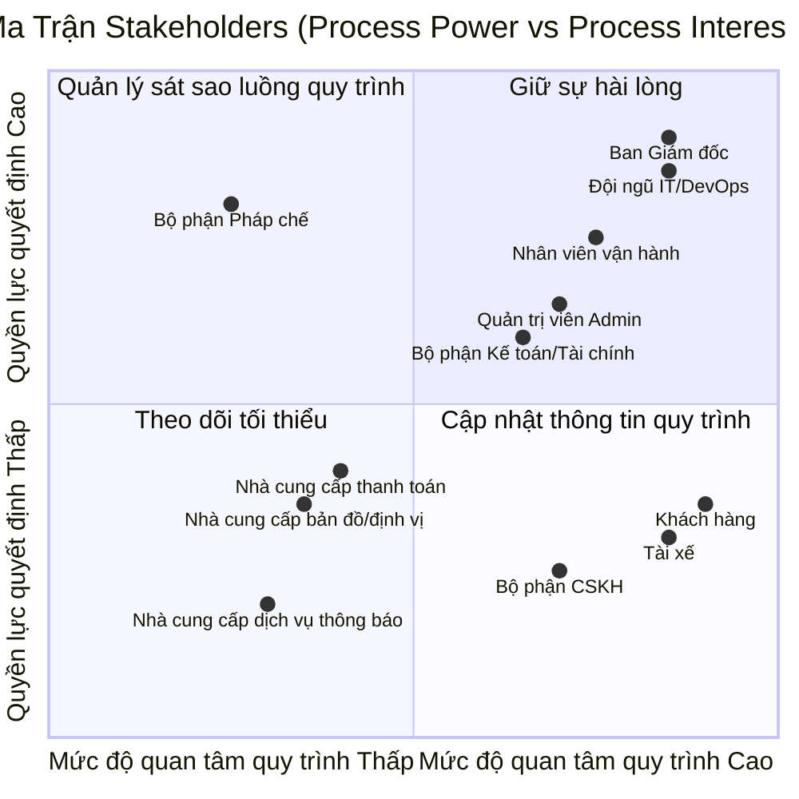
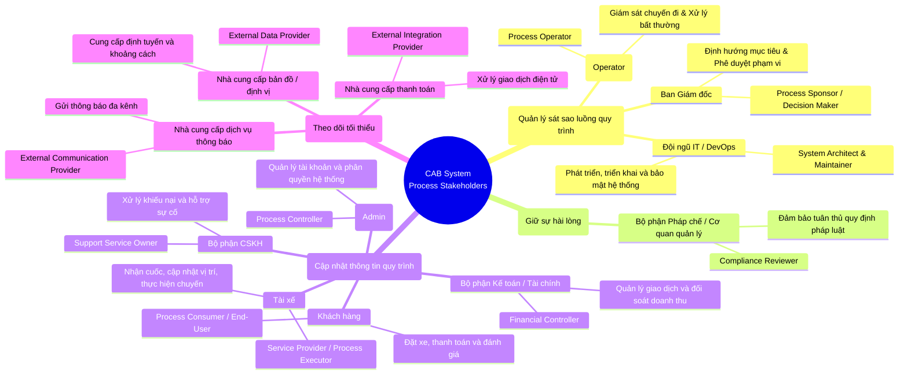

# 23651511_NguyenPhamMaiTrinh_cabsystem
# 1. Hạn chế của hệ thống hiện tại
## a. Các yêu điểm của hệ thống
* Thực hiện thủ công, khách hàng khó theo dõi trạng thái chuyến đi, thông tin thanh toán chưa được quản lý tập trung và bộ phận vận hành gặp khó khăn khi muốn mở rộng hệ thống
## b. Tại sao cần hệ thống mới?
* Đáp ứng quy mô lớn: Phục vụ số lượng lớn khách hàng và tài xế, đồng thời dễ dàng phát triển thêm tính năng trong tương lai.
* Tự động hóa vận hành:Thay thế việc phân công tài xế thủ công bằng cơ chế tự động tìm kiếm, phân phối và xử lý ngoại lệ thông minh.
* Nâng cao trải nghiệm người dùng: Giúp khách hàng theo dõi trực quan trạng thái chuyến đi, còn tài xế dễ dàng nhận/từ chối chuyến xe.
* Quản lý thanh toán tập trung: Tích hợp thanh toán linh hoạt (tiền mặt/điện tử) và bảo mật thông tin nhạy cảm.
* Cải thiện giám sát & báo cáo: Cung cấp giao diện quản trị, thông báo đa kênh và báo cáo hiệu quả hoạt động cho ban lãnh đạo.
* Đảm bảo ổn định & bảo mật: Tăng khả năng mở rộng độc lập từng phần, chống quá tải và bảo mật dữ liệu, phân quyền chặt chẽ.

## 2. Bảng Stakeholder và Vai trò
| STT | Stakeholder | Vai trò |
| :---: | :--- | :--- |
| **1** | Ban Giám đốc | Nhà tài trợ, người ra quyết định|
| **2** | Khách hàng | Người tiêu dùng, người sử dụng cuối|
| **3** | Tài xế | Nhà cung cấp dịch vụ, người thực thi quy trình|
| **4** | Nhân viên vận hành | Người vận hành quy trình|
| **5** | Quản trị viên  | Người kiểm soát quy trình|
| **6** | Bộ phận Kế toán / Tài chính | Người kiểm soát tài chính|
| **7** | Bộ phận CSKH | Chủ sở hữu dịch vụ hỗ trợ|
| **8** | Đội ngũ IT / DevOps | Kiến trúc sư hệ thống & Người bảo trì|
| **9** | Nhà cung cấp thanh toán | Nhà cung cấp tích hợp bên ngoài|
| **10** | Nhà cung cấp bản đồ / định vị | Nhà cung cấp dữ liệu bên ngoài|
| **11** | Nhà cung cấp dịch vụ thông báo | Nhà cung cấp dịch vụ truyền thông bên ngoài|
| **12** | Bộ phận Pháp chế / Cơ quan quản lý | Người đánh giá sự tuân thủ|

### Ma trận Matrix
### 1. Ma trận Stakeholders theo chuẩn MBP (Phân tích Quy trình)

## Giải thích Ma trận:
* Quản lý sát sao (Góc trên phải): Ban Giám đốc, IT/DevOps, Nhân viên vận hành. Nhóm nắm quyền lực lớn và trực tiếp vận hành hệ thống, cần được trao đổi và kiểm soát chặt chẽ.
* Giữ sự hài lòng (Góc trên trái): Bộ phận Pháp chế. Ít tham gia vận hành nhưng có quyền kiểm soát pháp lý, chỉ cần đảm bảo hệ thống tuân thủ luật pháp.
* Cập nhật thông tin (Góc dưới phải): Khách hàng, Tài xế, Admin, Kế toán, CSKH. Người dùng trực tiếp, rất quan tâm vì ảnh hưởng đến công việc và tiền bạc, cần thông báo và hỗ trợ thường xuyên.
* Theo dõi tối thiểu (Góc dưới trái): Các bên thứ ba (Thanh toán, Bản đồ, Thông báo). Chỉ cung cấp dịch vụ kỹ thuật phụ trợ, định kỳ kiểm tra hiệu năng là đủ.

## 3. Business Purpose
* **Tối ưu hóa hiệu suất vận hành:** Tự động hóa hoàn toàn quy trình ghép nối giữa khách hàng và tài xế dựa trên thuật toán định vị thông minh, giúp giảm thiểu thời gian chờ đợi (ETA) và nâng cao tỷ lệ hoàn thành chuyến đi.
* **Minh bạch hóa dòng tiền & Giao dịch tài chính:** Cung cấp hệ thống thanh toán đa dạng (tiền mặt, ví điện tử, thẻ) kết hợp cơ chế đối soát tự động, giúp quản lý doanh thu, chiết khấu và dòng tiền của tài xế một cách chính xác, rõ ràng.
* **Nâng cao trải nghiệm người dùng:** Cung cấp giao diện trực quan, tính năng theo dõi hành trình thời gian thực, hệ thống đánh giá hai chiều và dịch vụ hỗ trợ (CSKH) nhanh chóng nhằm tối ưu hóa sự hài lòng cho cả khách hàng lẫn tài xế.
* **Đảm bảo tuân thủ & Quản trị rủi ro:** Xây dựng hệ thống phân quyền chặt chẽ, kiểm soát dữ liệu người dùng và đảm bảo toàn bộ hoạt động vận hành tuân thủ nghiêm ngặt các quy định pháp lý của cơ quan quản lý nhà nước về lĩnh vực vận tải công nghệ.

## 4. Xác định phạm vi 7 tuần
### a. Module Quản lý Khách hàng
* **Quy trình Xác thực & Hồ sơ:** Hỗ trợ người dùng định danh (Đăng ký/Đăng nhập) và quản lý thông tin cá nhân.
* **Quy trình Khởi tạo yêu cầu:** Cho phép người tiêu dùng quy trình chọn điểm đón/đến, chọn loại dịch vụ, nhận báo giá tự động và gửi yêu cầu đặt xe.
* **Quy trình Theo dõi & Trải nghiệm:** Giám sát vị trí thời gian thực (GPS), tính toán thời gian đến dự kiến (ETA) và tra cứu lịch sử hành trình.
* **Quy trình Đánh giá chất lượng:** Chấm điểm và gửi nhận xét dịch vụ sau khi kết thúc chuỗi giá trị.

### b. Module Quản lý Tài xế và Phương tiện
* **Quy trình Quản lý Hồ sơ & Tài nguyên:** Tiếp nhận, kiểm duyệt và cập nhật thông tin tài xế cùng phương tiện vận tải (do Tài xế hoặc Operator thực hiện).
* **Quy trình Kiểm soát Trạng thái & Định vị:** Quản lý trạng thái sẵn sàng phục vụ, tự động thu thập và đồng bộ tọa độ GPS thời gian thực về hệ thống điều phối.
* **Quy trình Thực thi dịch vụ:** Tiếp nhận/Từ chối cuốc xe và cập nhật tuần tự các mốc tiến trình nghiệp vụ 

### c. Module Tính cước và Thanh toán
* **Quy trình Tính cước tự động:** Áp dụng biểu phí linh hoạt dựa trên loại dịch vụ và thông tin tọa độ/khoảng cách tuyến đường.
* **Quy trình Tích hợp cổng thanh toán:** Kết nối an toàn với các đơn vị thanh toán ngoài để xử lý giao dịch điện tử mà không lưu trữ dữ liệu nhạy cảm.
* **Quy trình Đối soát & Xử lý ngoại lệ:** Hỗ trợ thanh toán tiền mặt/điện tử; ghi nhận, thông báo và cho phép xử lý lại giao dịch khi xảy ra lỗi thanh toán.

### d. Module Thông báo Đa kênh
* **Quy trình Phát thông báo Khách hàng:** Tự động gửi thông tin cập nhật theo các mốc: tiếp nhận đơn, có tài xế nhận, tài xế đến điểm đón, kết thúc chuyến và trạng thái thanh toán.
* **Quy trình Phát thông báo Tài xế:** Cung cấp thông tin điều phối cuốc xe mới hoặc các thay đổi khẩn cấp trong hành trình.

### e. Module Vận hành, Quản trị & Báo cáo
* **Quy trình Giám sát vận hành:** Bảng điều khiển trực quan giúp Operator theo dõi các chuyến đi đang thực thi, kiểm soát trạng thái tài xế, xử lý ngoại lệ và tra cứu lịch sử giao dịch.
* **Quy trình Kiểm soát hệ thống):** Quản lý tài khoản, thiết lập phân quyền truy cập nghiêm ngặt theo vai trò để bảo vệ dữ liệu nhạy cảm.
* **Quy trình Đo lường hiệu suất:** Tổng hợp dữ liệu về tổng số chuyến, doanh thu, tỷ lệ hoàn thành, tỷ lệ hủy chuyến và đánh giá hiệu quả hoạt động của tài xế.

## 4. Chuyển các yêu cầu thành yêu cầu nghiệp vụ
### a. Yêu cầu Quản lý Khách hàng 
* **BRa01:** Hệ thống phải cung cấp cổng định danh an toàn để người dùng thực hiện quy trình đăng ký, đăng nhập và bảo mật thông tin cá nhân.
* **BRa02:** Quy trình đặt xe phải cho phép khách hàng nhập điểm đi/đến, chọn loại dịch vụ, xem trước biểu phí tự động và gửi yêu cầu khởi tạo chuyến đi.
* **BRa03:** Hệ thống phải hỗ trợ luồng theo dõi hành trình trực tuyến , hiển thị chính xác vị trí tài xế và thời gian đến dự kiến trên giao diện khách hàng.
* **BRa04:** Sau khi hoàn thành chuỗi giá trị dịch vụ, hệ thống phải cung cấp vòng lặp phản hồi (Feedback Loop) cho phép khách hàng chấm điểm và đánh giá chất lượng tài xế.

### b. Yêu cầu Quản lý Tài xế và Phương tiện
* **BRb01:** Quy trình tiếp nhận tài nguyên phải cho phép Tài xế hoặc Nhân viên vận hành (Operator) tạo, cập nhật hồ sơ cá nhân và thông tin phương tiện, kèm theo bước kiểm duyệt trước khi kích hoạt tài khoản.
* **BRb02:** Hệ thống phải duy trì luồng đồng bộ trạng thái trực tuyến (Online/Offline) và tự động thu thập tọa độ GPS định kỳ từ thiết bị của tài xế để phục vụ công tác điều phối.
* **BRb03:** Quy trình thực thi chuyến đi phải hỗ trợ tài xế tiếp nhận/từ chối cuốc xe và cập nhật tuần tự các mốc trạng thái nghiệp vụ 

### c. Yêu cầu Tính cước và Thanh toán
* **BRc01:** Hệ thống phải tự động tính toán giá cước dựa trên công thức cấu thành từ loại dịch vụ, khoảng cách định tuyến thực tế và các hệ số điều chỉnh theo thời điểm.
* **BRc02:** Quy trình thanh toán điện tử phải được tích hợp thông qua các nhà cung cấp cổng thanh toán độc lập bên ngoài, đảm bảo không lưu trữ trực tiếp dữ liệu thẻ nhạy cảm trong hệ thống nội bộ.
* **BRc03:** Hệ thống phải xử lý linh hoạt cả hai hình thức thanh toán (Tiền mặt / Điện tử); đồng thời cung cấp cơ chế ghi nhận, thông báo lỗi và quy trình xử lý ngoại lệ khi giao dịch thanh toán thất bại.

### d. Yêu cầu Thông báo Đa kênh
* **BRd01:** Quy trình thông báo cho khách hàng phải tự động kích hoạt gửi tin cập nhật theo các mốc: hệ thống nhận đơn, tài xế tiếp nhận, tài xế đến điểm đón, kết thúc chuyến và trạng thái thanh toán.
* **BRd02:** Quy trình thông báo cho tài xế phải đảm bảo truyền tải thông tin điều phối cuốc xe mới hoặc các thay đổi khẩn cấp về hành trình một cách tức thời.

### e. Yêu cầu Vận hành, Quản trị & Báo cáo
* **BRe01:** Hệ thống phải cung cấp giao diện Cổng thông tin vận hành (Operator Portal) giúp nhân viên giám sát các chuyến đi đang thực thi, theo dõi trạng thái tài xế và xử lý các sự cố phát sinh.
* **BRe02:** Quản trị viên (Admin) phải được cung cấp công cụ phân quyền truy cập nghiêm ngặt theo vai trò (RBAC) nhằm bảo mật các cấu hình hệ thống và dữ liệu nhạy cảm.
* **BRe03:** Hệ thống phải tích hợp module báo cáo tự động tổng hợp các chỉ số hiệu suất chính (KPIs) như tổng số chuyến đi, tổng doanh thu, tỷ lệ hoàn thành, tỷ lệ hủy chuyến và hiệu quả hoạt động của tài xế.

## 6. Phân rã yêu cầu chức năng
### a. Quản lý Tài khoản
* **FRa01:** Hệ thống cung cấp chức năng đăng ký tài khoản phân tách rõ theo vai trò: Khách hàng, Tài xế và Quản trị viên.
* **FRa02:** Hệ thống cung cấp cơ chế đăng nhập bảo mật kèm tính năng khôi phục mật khẩu qua mã OTP.
* **FRa03:** Hệ thống cho phép người dùng xem và cập nhật thông tin hồ sơ cá nhân (Ảnh đại diện, số điện thoại, thông tin liên lạc).
* **FRa04:** Quản trị viên thực hiện chức năng phân quyền truy cập hệ thống theo mô hình RBAC đối với các nhân viên vận hành và kế toán.

### b. Đặt xe 
* **FRb01:** Khách hàng chọn điểm đón và điểm đến trên bản đồ, hệ thống tự động xác định tọa độ và hiển thị tuyến đường sơ bộ.
* **FRb02:** Hệ thống tính toán và hiển thị danh sách các loại hình dịch vụ kèm theo giá cước ước tính trước khi khách hàng xác nhận đặt xe.
* **FRb03:** Hệ thống thực thi thuật toán tự động tìm kiếm, quét và phân công cuốc xe cho tài xế phù hợp đang ở trạng thái sẵn sàng trong khu vực lân cận.
* **FRb04:** Tài xế nhận được thông báo yêu cầu cuốc xe, có quyền thực hiện hành động **Nhận chuyến** hoặc **Từ chối chuyến** trong thời gian quy định.

### c. Chuyến đi & Định vị
* **FRc01:** Thiết bị của tài xế gửi tọa độ GPS định kỳ về hệ thống để cập nhật vị trí thời gian thực.
* **FRc02:** Giao diện khách hàng và vận hành hiển thị trực quan bản đồ hành trình di chuyển của tài xế cùng thời gian dự kiến đến
* **FRc03:** Tài xế thao tác cập nhật tiến trình chuyến đi qua các mốc trạng thái chuẩn: *Đã đến điểm đón $\rightarrow$ Đã đón khách $\rightarrow$ Đang di chuyển $\rightarrow$ Hoàn thành chuyến đi*.
* **FRc04:** Hệ thống cung cấp cơ chế cho phép hủy chuyến đi có điều kiện.

### d. Tính cước & Thanh toán
* **FRd01:** Hệ thống tự động tính toán tổng số tiền cước dựa trên biểu phí cấu hình sẵn (giá mở cửa, giá theo quãng đường, hệ số giờ cao điểm/thời tiết).
* **FRd02:** Hệ thống hỗ trợ phương thức thanh toán tiền mặt và tích hợp cổng thanh toán điện tử của bên thứ ba để xử lý giao dịch thẻ/ví điện tử.
* **FRd03:** Ghi nhận và lưu trữ trạng thái thanh toán của từng chuyến đi (Đã thanh toán / Chưa thanh toán / Lỗi giao dịch).
* **FRd04:** Cung cấp tính năng thông báo lỗi giao dịch và cho phép thực hiện quy trình xử lý thanh toán lại (Retry payment) khi có sự cố.

### e. Thông báo & Phản hồi
* **FRe01:** Hệ thống tự động đẩy thông báo (Push Notification / SMS) tới khách hàng theo các mốc: Đã nhận đơn, có tài xế nhận, tài xế đến nơi, kết thúc chuyến và kết quả thanh toán.
* **FRe02:** Hệ thống gửi thông báo điều phối cuốc xe mới hoặc các tin nhắn khẩn cấp tới ứng dụng của tài xế.
* **FRe01:** Sau khi hoàn thành chuyến đi, hệ thống kích hoạt tính năng đánh giá sao (1-5 sao) và gửi nhận xét từ khách hàng dành cho tài xế.

### f. Vận hành, Quản trị & Báo cáo
* **FRf01:** Giao diện Cổng thông tin vận hành (Operator Portal) hiển thị màn hình giám sát toàn bộ các chuyến đi đang diễn ra và trạng thái trực tuyến của tài xế.
* **FRf02:** Nhân viên vận hành có quyền can thiệp thủ công để hỗ trợ xử lý các ngoại lệ (ví dụ: đổi tài xế, hủy chuyến hộ, giải quyết khiếu nại).
* **FRf03:** Hệ thống tự động tổng hợp dữ liệu và xuất báo cáo thống kê trực quan về tổng số chuyến, tổng doanh thu, tỷ lệ hoàn thành và hiệu suất hoạt động.
  ## 7. Vẽ usecase
  ## 8. Đặc tả usecase
  ## 9. Phân tích quy trình nghiệp vụ
1. **Giai đoạn Khởi tạo & Tiếp nhận:** 
   - Khách hàng thực hiện định danh tài khoản, nhập lộ trình điểm đón và điểm đến. 
   - Hệ thống tự động tính cước dựa trên loại hình dịch vụ và tiếp nhận yêu cầu đặt xe.

2. **Giai đoạn Điều phối & Ghép nối:** 
   - Thuật toán quét và lọc tài xế đang ở trạng thái trực tuyến (Online) dựa trên tọa độ GPS. 
   - Hệ thống tự động gửi tín hiệu điều phối đến tài xế ưu tiên ở vị trí gần nhất.

3. **Giai đoạn Thực thi Dịch vụ:** 
   - Tài xế di chuyển thực hiện cuốc xe và liên tục cập nhật tuần tự các mốc trạng thái nghiệp vụ về trung tâm

4. **Giai đoạn Thanh toán & Đánh giá:** 
   - Hệ thống chốt cước phí dựa trên lộ trình thực tế, xử lý thanh toán linh hoạt (tiền mặt hoặc cổng điện tử bên ngoài). 
   - Sau khi hoàn tất thanh toán, hệ thống kích hoạt vòng lặp phản hồi để khách hàng đánh giá sao cho tài xế.

5. **Giai đoạn Giám sát Vận hành:** 
   - Nhân viên vận hành theo dõi trực tuyến qua Dashboard để can thiệp xử lý ngoại lệ (hủy chuyến, đổi tài xế, khiếu nại). 
   - Hệ thống tự động tổng hợp báo cáo hiệu suất để phục vụ công tác quản trị và ra quyết định của ban lãnh đạo.
  ## 10. Phân tích nguyên tắc nghiệp vụ
* **Quy tắc Phân công và Xử lý từ chối:** Hệ thống bắt buộc phải ưu tiên phân phối cuốc xe cho tài xế ở trạng thái sẵn sàng và ở khoảng cách gần khách hàng nhất. Nếu tài xế được đề xuất từ chối hoặc không phản hồi trong thời gian giới hạn, hệ thống phải tự động chuyển tiếp sang tài xế tiếp theo mà không làm gián đoạn hoặc yêu cầu khách hàng phải tạo lại yêu cầu.
* **Quy tắc Tách biệt Dữ liệu Thanh toán & Bảo mật:** Tuyệt đối không lưu trữ trực tiếp thông tin nhạy cảm của thẻ hoặc tài khoản thanh toán nội bộ bên trong hệ thống CAB System. Mọi giao dịch điện tử phải được thực hiện thông qua liên kết bảo mật với nhà cung cấp cổng thanh toán độc lập bên ngoài.
* **Quy tắc Phân quyền và Kiểm soát Truy cập RBAC:** Mọi tác nhân (Khách hàng, Tài xế, Nhân viên vận hành) phải đi qua cổng định danh và xác thực an toàn. Các thao tác quản trị hệ thống nhạy cảm phải được phân quyền chặt chẽ theo vai trò (RBAC) để bảo vệ dữ liệu cá nhân, phương tiện và giao dịch.
* **Quy tắc Kiến trúc Độc lập & Ổn định:** Các thành phần chức năng (như Thanh toán, Thông báo, Đặt xe) phải được thiết kế dạng module mở rộng độc lập. Khi một sự cố xảy ra ở module phụ trợ (ví dụ lỗi cổng thanh toán hoặc lỗi gửi thông báo), hệ thống không được làm ngưng trệ toàn bộ nền tảng đặt xe và cho phép triển khai nâng cấp từng phần.
  
