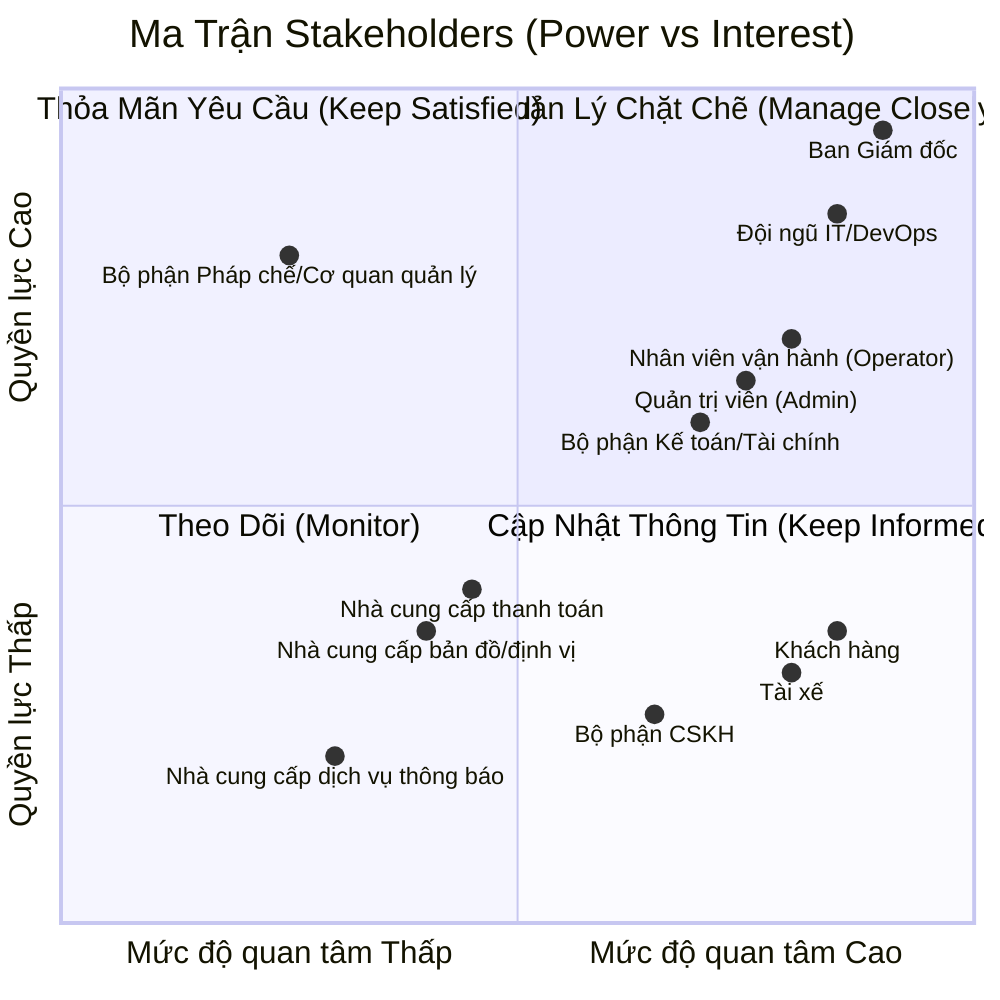
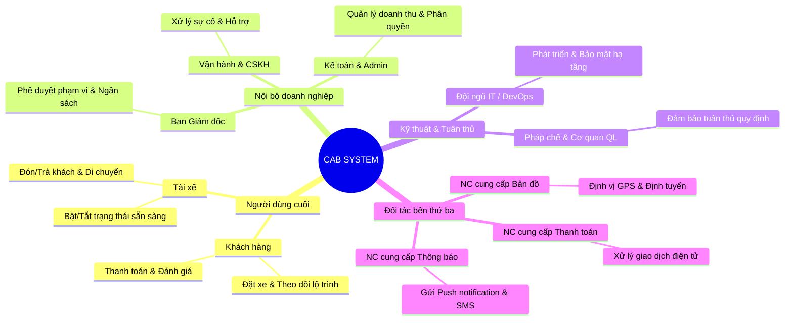

# 23651511_NguyenPhamMaiTrinh_cabsystem
# 1. Hạn chế của hệ thống hiện tại
## a. Các yêu điểm của hệ thống
### Thực hiện thủ công, khách hàng khó theo dõi trạng thái chuyến đi, thông tin thanh toán chưa được quản lý tập trung và bộ phận vận hành gặp khó khăn khi muốn mở rộng hệ thống
## b. Tại sao cần hệ thống mới?
### Tự động hóa: Tự tìm và gán tài xế gần nhất bằng GPS, giảm tối đa thời gian chờ.
### Minh bạch & Tiện lợi: Đặt xe, theo dõi hành trình real-time, thanh toán online an toàn.
### Kiến trúc linh hoạt: Các thành phần (Thanh toán, Thông báo, Tìm xe) chạy độc lập, chịu tải tốt vào giờ cao điểm.
### Dễ nâng cấp: Sẵn sàng mở rộng thêm dịch vụ, cổng thanh toán mới trong tương lai mà không cần làm lại từ đầu.
## c. Làm sao để nhân viên không can thiệp trái phép vào dữ liệu quan trọng?
### Hệ thống phân quyền truy cập theo vai trò (RBAC) và lưu nhật ký vết thao tác (Audit Log). Nhân viên chỉ thao tác đúng nghiệp vụ được giao, mọi hành động nhạy cảm đều bị giám sát.

## 2. Bảng Stakeholder và Vai trò
| STT | Stakeholder | Vai trò |
| :---: | :--- | :--- |
| **1** | Ban Giám đốc | Định hướng mục tiêu, phê duyệt phạm vi và yêu cầu của hệ thống |
| **2** | Khách hàng | Đăng ký, đặt xe, theo dõi chuyến, thanh toán và đánh giá tài xế |
| **3** | Tài xế | Cập nhật trạng thái, nhận/từ chối chuyến, thực hiện chuyến và cập nhật vị trí |
| **4** | Nhân viên vận hành (Operator) | Theo dõi chuyến, quản lý tài xế, xử lý các trường hợp bất thường |
| **5** | Quản trị viên (Admin) | Quản lý tài khoản, phân quyền, cấu hình và kiểm soát hệ thống |
| **6** | Bộ phận Kế toán/Tài chính | Quản lý giao dịch, đối soát thanh toán và theo dõi doanh thu |
| **7** | Bộ phận CSKH | Hỗ trợ khách hàng, tài xế và xử lý khiếu nại/sự cố |
| **8** | Đội ngũ IT/DevOps | Phát triển, triển khai, vận hành, bảo mật và đảm bảo khả năng mở rộng hệ thống |
| **9** | Nhà cung cấp thanh toán | Xử lý các giao dịch thanh toán điện tử |
| **10** | Nhà cung cấp bản đồ/định vị | Cung cấp dữ liệu vị trí, khoảng cách và định tuyến |
| **11** | Nhà cung cấp dịch vụ thông báo | Gửi thông báo đến khách hàng và tài xế |
| **12** | Bộ phận Pháp chế/Cơ quan quản lý | Đảm bảo hệ thống tuân thủ các quy định pháp luật liên quan |

### Ma trận Matrix

## 3. Business Purpose

a. **Tự động hóa & Tối ưu Vận hành:** 
   - Tự động ghép chuyến cho tài xế gần nhất bằng thuật toán định vị GPS.
   - Tự động chuyển chuyến sang tài xế tiếp theo khi bị từ chối, giảm tối đa thời gian chờ của khách hàng.

b. **Nâng cao Trải nghiệm Người dùng:**
   - **Khách hàng:** Đặt xe nhanh chóng, biết trước giá cước, theo dõi lộ trình thời gian thực (Realtime GPS) và thanh toán linh hoạt.
   - **Tài xế:** Chủ động bật/tắt trạng thái làm việc, tối ưu quãng đường di chuyển và quản lý thu nhập minh bạch.

c. **Chuẩn hóa Quản trị & Ra Quyết định:**
   - Quản lý tập trung dữ liệu khách hàng, tài xế, phương tiện và lịch sử chuyến đi.
   - Phân quyền chặt chẽ (RBAC) để bảo vệ dữ liệu nhạy cảm và lưu vết (*Audit Log*) phục vụ kiểm tra sự cố.
   - Cung cấp báo cáo thời gian thực về doanh thu, tỷ lệ hoàn thành/hủy chuyến và hiệu suất tài xế.

d. **Xây dựng Nền tảng Linh hoạt & Mở rộng:**
   - Đảm bảo hệ thống hoạt động ổn định, chịu tải cao trong giờ cao điểm.
   - Dễ dàng tích hợp thêm các dịch vụ, cổng thanh toán hoặc kênh thông báo mới trong tương lai mà không làm ảnh hưởng đến kiến trúc hiện tại.
## 4. Xác định phạm vi trong 7 tuần
### a.  Module Quản lý Khách hàng 
* **Tài khoản & Xác thực:** Đăng ký, đăng nhập, bảo mật tài khoản và cập nhật hồ sơ cá nhân.
* **Tạo & Đặt chuyến:** Chọn điểm đón/đến, chọn loại xe, xem giá cước dự kiến và gửi yêu cầu.
* **Theo dõi Realtime:** Theo dõi vị trí tài xế theo thời gian thực (GPS), thời gian dự kiến đến (ETA) và lịch sử chuyến đi.
* **Đánh giá:** Chấm điểm và gửi nhận xét tài xế sau khi hoàn thành chuyến đi.

### b. Module Quản lý Tài xế và Phương tiện 
* **Hồ sơ & Xe:** Tạo/Cập nhật tài khoản (bởi Tài xế hoặc Operator), cập nhật hồ sơ và thông tin phương tiện.
* **Quản lý Trạng thái & GPS:** Bật/Tắt trạng thái sẵn sàng làm việc, tự động lưu và gửi tọa độ vị trí GPS về hệ thống.
* **Xử lý Chuyến đi:** Nhận/Từ chối chuyến đi và cập nhật tiến trình (*Đã đến điểm đón $\rightarrow$ Đã đón khách $\rightarrow$ Đang di chuyển $\rightarrow$ Hoàn thành*).

### c. Module Tính cước và Thanh toán 
* **Tính cước tự động:** Xác định giá tiền dựa trên loại dịch vụ/xe và thông tin khoảng cách chuyến đi.
* **Tích hợp Cổng thanh toán:** Kết nối nhà cung cấp thanh toán bên ngoài (không lưu trực tiếp thông tin thẻ/tài khoản nhạy cảm trong hệ thống CAB).
* **Thanh toán đa dạng & Xử lý lỗi:** Hỗ trợ Tiền mặt / Thanh toán điện tử; thông báo và cho phép xử lý lại theo chính sách khi giao dịch thất bại.

### d. Module Thông báo Đa kênh 
* **Thông báo Khách hàng:** Gửi cập nhật khi tiếp nhận đơn, có tài xế nhận, tài xế đến điểm đón, hoàn thành chuyến và kết quả thanh toán.
* **Thông báo Tài xế:** Gửi thông báo phát chuyến mới hoặc các thay đổi liên quan đến chuyến đi.
* **Khả năng Mở rộng:** Thiết kế dạng dịch vụ độc lập để dễ dàng thêm các kênh thông báo mới trong tương lai.

### e. Module Vận hành, Quản trị & Báo cáo 
* **Giao diện Điều hành (Operator Portal):** Giám sát các chuyến đi đang diễn ra, kiểm tra trạng thái tài xế, hỗ trợ xử lý chuyến đi bị lỗi và tra cứu lịch sử giao dịch.
* **Quản trị & Phân quyền (Admin):** Phân quyền truy cập theo vai trò, giới hạn thao tác nhạy cảm đối với nhân viên thông thường.
* **Báo cáo Kinh doanh & Hiệu suất:** Thống kê tổng số chuyến, doanh thu, tỷ lệ hoàn thành, tỷ lệ hủy chuyến và hiệu quả hoạt động của tài xế.
* **Nhật ký Hệ thống (Audit Log):** Lưu vết toàn bộ các thao tác quan trọng để kiểm tra khi xảy ra sự cố.

## 4. Chuyển các yêu cầu thành yêu cầu nghiệp vụ
### BR-01: Quản lý Khách hàng
* **BR-01.1 (Định danh & Bảo mật):** Hệ thống phải cho phép Khách hàng đăng ký, đăng nhập và tự quản lý thông tin cá nhân an toàn để tham gia sử dụng dịch vụ.
* **BR-01.2 (Đặt xe & Minh bạch Cước phí):** Khách hàng phải biết trước giá cước ước tính và khoảng cách di chuyển dựa trên loại xe đã chọn trước khi xác nhận đặt chuyến.
* **BR-01.3 (Giám sát Chuyến đi):** Khách hàng phải theo dõi được vị trí tài xế và lộ trình di chuyển theo thời gian thực (Realtime) để chủ động thời gian và đảm bảo an toàn.
* **BR-01.4 (Đánh giá Dịch vụ):** Hệ thống phải cho phép Khách hàng chấm điểm và phản hồi chất lượng dịch vụ sau mỗi chuyến đi để doanh nghiệp kiểm soát chất lượng tài xế.

### BR-02: Quản lý Tài xế & Phương tiện
* **BR-02.1 (Quản lý Hồ sơ & Phương tiện):** Hệ thống phải lưu trữ và quản lý thông tin định danh của Tài xế, bằng lái và thông tin phương tiện (biển số, loại xe) để đảm bảo điều kiện pháp lý khi vận hành.
* **BR-02.2 (Linh hoạt Trạng thái Làm việc):** Tài xế phải có quyền chủ động chuyển đổi trạng thái *Sẵn sàng nhận chuyến* hoặc *Tắt ứng dụng* để hệ thống ghi nhận đúng độ khả dụng.
* **BR-02.3 (Tối ưu Tiếp nhận Chuyến):** Tài xế phải nhận được đầy đủ thông tin điểm đón, điểm đến và cước phí ước tính để quyết định tiếp nhận hoặc từ chối chuyến đi trong thời gian quy định.

### BR-03: Điều hành & Điều xe Tự động 
* **BR-03.1 (Ghép chuyến Tự động theo GPS):** Hệ thống phải tự động quét và đề xuất chuyến đi cho Tài xế gần điểm đón nhất dựa trên tọa độ GPS nhằm giảm thiểu thời gian chờ đợi của Khách hàng.
* **BR-03.2 (Xử lý Từ chối / Bỏ qua Chuyến):** Nếu Tài xế từ chối hoặc không phản hồi trong thời gian quy định, hệ thống phải tự động luân chuyển yêu cầu sang Tài xế phù hợp tiếp theo mà không làm gián đoạn hoặc bắt Khách hàng thao tác lại.
* **BR-03.3 (Hỗ trợ Điều hành Thủ công):** Nhân viên Vận hành (Operator) phải có khả năng can thiệp, hủy chuyến hoặc điều chỉnh thông tin chuyến đi trong các trường hợp ngoại lệ/sự cố.

### BR-04: Tính Cước & Thanh toán
* **BR-04.1 (Đa dạng Phương thức Thanh toán):** Hệ thống phải hỗ trợ thanh toán bằng Tiền mặt và Thanh toán Điện tử qua các Cổng thanh toán trung gian.
* **BR-04.2 (An toàn Thông tin Tài chính):** Hệ thống không được lưu trữ thông tin nhạy cảm của thẻ/tài khoản ngân hàng trực tiếp; mọi giao dịch phải được thực hiện thông qua cơ chế Tokenization của đối tác thanh toán.
* **BR-04.3 (Xử lý Ngoại lệ Thanh toán):** Khi giao dịch thanh toán điện tử thất bại, hệ thống phải cho phép xử lý lại hoặc chuyển đổi sang hình thức thanh toán tiền mặt để đảm bảo thu đủ tiền cước.

### BR-05: Thông báo Đa kênh
* **BR-05.1 (Cập nhật Trạng thái Kịp thời):** Hệ thống phải tự động gửi thông báo đến Khách hàng và Tài xế ngay khi có thay đổi trạng thái chuyến đi (ví dụ: *Đã tìm thấy tài xế*, *Tài xế đã đến*, *Hoàn thành chuyến*, *Thanh toán thành công*).
* **BR-05.2 (Khả năng Mở rộng Kênh Thông báo):** Kiến trúc gửi thông báo phải hoạt động độc lập để dễ dàng tích hợp thêm các kênh thông báo mới (SMS, Email, Push Notification) trong tương lai.

### BR-06: Quản trị, Báo cáo & Kiểm soát
* **BR-06.1 (Phân quyền Truy cập RBAC):** Hệ thống phải phân quyền nghiêm ngặt theo vai trò (Admin, Operator, Kế toán), hạn chế quyền truy cập các chức năng nhạy cảm đối với nhân viên không đúng thẩm quyền.
* **BR-06.2 (Báo cáo Hiệu quả Kinh doanh):** Ban Giám đốc và Kế toán phải theo dõi được các chỉ số đo lường kinh doanh chính (Doanh thu, Tỷ lệ chuyến hoàn thành/hủy, Hiệu suất tài xế) theo thời gian.
* **BR-06.3 (Lưu vết Hệ thống - Audit Log):** Mọi thao tác quan trọng (sửa dữ liệu, can thiệp chuyến đi, thay đổi trạng thái tài khoản) phải được ghi nhật ký hệ thống để phục vụ công tác kiểm tra và xử lý tranh chấp khi có sự cố.

## 6. Phân rã yêu cầu chức năng (Functional Requirement Decomposition)
### 6.1. Module Quản lý Khách hàng (FR-01)
* **FR-01.1: Quản lý Tài khoản & Định danh**
  * Đăng ký tài khoản mới qua Số điện thoại / OTP hoặc Email.
  * Đăng nhập, đăng xuất và khôi phục mật khẩu.
  * Cập nhật thông tin cá nhân (Họ tên, Email, Ảnh đại diện).
* **FR-01.2: Tạo & Đặt chuyến**
  * Nhập/chọn điểm đón và điểm đến trên bản đồ.
  * Chọn loại dịch vụ/phương tiện (Xe 4 chỗ, Xe 7 chỗ, Xe máy...).
  * Hiển thị xem trước lộ trình, ước tính khoảng cách, thời gian di chuyển và cước phí tạm tính.
  * Xác nhận gửi yêu cầu đặt xe lên hệ thống.
* **FR-01.3: Theo dõi chuyến đi (Realtime Tracking)**
  * Hiển thị màn hình chờ ghép nối tài xế kèm trạng thái tìm kiếm.
  * Xem thông tin tài xế đã nhận chuyến (Họ tên, Số điện thoại, Biển số xe, Loại xe, Đánh giá).
  * Theo dõi vị trí GPS di chuyển thời gian thực của tài xế trên bản đồ và thời gian dự kiến đến (ETA).
* **FR-01.4: Lịch sử & Đánh giá**
  * Xem lịch sử các chuyến đi đã thực hiện (Thời gian, Lộ trình, Cước phí, Trạng thái).
  * Chấm điểm sao (1 - 5 sao) và gửi phản hồi/nhận xét về tài xế sau khi hoàn thành chuyến.
### 6.2. Module Quản lý Tài xế & Phương tiện (FR-02)
* **FR-02.1: Quản lý Hồ sơ & Phương tiện**
  * Đăng ký tài khoản tài xế hoặc tiếp nhận tài khoản được tạo bởi Operator.
  * Cập nhật thông tin cá nhân, Bằng lái xe, Căn cước công dân.
  * Đăng ký thông tin phương tiện (Hãng xe, Biển số xe, Màu xe, Số chỗ).
* **FR-02.2: Quản lý Trạng thái & Định vị GPS**
  * Bật/Tắt nút chuyển đổi trạng thái hoạt động ("Sẵn sàng nhận chuyến" / "Tắt ứng dụng").
  * Tự động thu thập và gửi tọa độ GPS về hệ thống theo chu kỳ thời gian thực khi đang ở trạng thái sẵn sàng hoặc đang thực hiện chuyến.
* **FR-02.3: Tiếp nhận & Xử lý chuyến đi**
  * Nhận màn hình thông báo chuyến đi mới kèm thông tin điểm đón, điểm đến, cước phí và đếm ngược thời gian phản hồi.
  * Xác nhận Chấp nhận hoặc Từ chối chuyến đi.
  * Cập nhật các trạng thái tiến trình hành trình: *Đã đến điểm đón $\rightarrow$ Đã đón khách $\rightarrow$ Đang di chuyển $\rightarrow$ Hoàn thành chuyến*.
  * Xem lịch sử chuyến đi và thống kê thu nhập theo ngày/tuần.
### 6.3. Module Điều hành & Điều xe Tự động (FR-03)
* **FR-03.1: Thuật toán Tự động Ghép chuyến (Driver Matching)**
  * Quét vị trí GPS của các tài xế đang "Sẵn sàng" trong bán kính khu vực xung quanh điểm đón.
  * Tính toán và gửi yêu cầu chuyến đi ưu tiên cho tài xế phù hợp nhất (gần nhất, đáp ứng loại dịch vụ).
* **FR-03.2: Xử lý Chuyển tiếp & Ngoại lệ Ghép chuyến**
  * Tự động đếm ngược thời gian phản hồi của tài xế (Timeout handling).
  * Tự động chuyển yêu cầu sang tài xế phù hợp tiếp theo nếu tài xế trước từ chối hoặc hết giờ phản hồi mà không bắt Khách hàng đặt lại.
  * Gửi thông báo "Không tìm thấy tài xế" cho Khách hàng nếu quét hết danh sách tài xế hợp lệ trong bán kính quy định.
* **FR-03.3: Can thiệp Điều hành Thủ công**
  * Cho phép Operator tìm kiếm và gán thủ công tài xế cho chuyến đi trong trường hợp đặc biệt.
  * Cho phép Operator hủy chuyến đi bị treo/lỗi theo yêu cầu từ Khách hàng hoặc Tài xế.
### 6.4. Module Tính cước & Thanh toán (FR-04)
* **FR-04.1: Tính cước Tự động**
  * Tự động tính tổng tiền cước dựa trên: Giá mở cửa, khoảng cách lộ trình (km), loại dịch vụ xe và phụ phí (nếu có).
  * Khóa giá cước niêm yết tại thời điểm khách hàng chốt đặt xe.
* **FR-04.2: Tích hợp Thanh toán Điện tử (Tokenization)**
  * Hỗ trợ phương thức thanh toán Tiền mặt.
  * Tích hợp cổng thanh toán bên thứ ba (Ví điện tử / Thẻ ngân hàng) thông qua SDK/API Tokenization (không lưu thông tin thẻ nhạy cảm trên hệ thống CAB).
* **FR-04.3: Xử lý Giao dịch & Sự cố Thanh toán**
  * Gửi lệnh gạch nợ/thanh toán tự động ngay khi tài xế bấm "Hoàn thành chuyến".
  * Ghi nhận trạng thái giao dịch (Thành công / Thất bại).
  * Cho phép khách hàng chuyển đổi sang Tiền mặt hoặc gửi lại yêu cầu thanh toán (Retry) khi giao dịch điện tử thất bại.
### 6.5. Module Thông báo Đa kênh (FR-05)
* **FR-05.1: Bắn Thông báo Real-time (Push Notification)**
  * Gửi thông báo cho Khách hàng: *Đã nhận đơn $\rightarrow$ Đã tìm thấy tài xế $\rightarrow$ Tài xế đã đến điểm đón $\rightarrow$ Chuyến đi hoàn thành $\rightarrow$ Kết quả thanh toán*.
  * Gửi thông báo cho Tài xế: *Có chuyến đi mới $\rightarrow$ Khách hàng hủy chuyến $\rightarrow$ Cập nhật thông tin lộ trình*.
* **FR-05.2: Quản lý & Mở rộng Hạ tầng Thông báo**
  * Cung cấp cơ chế dịch vụ gửi tin trung gian (Notification Service) kết nối qua API.
  * Sẵn sàng tích hợp thêm các kênh thông báo dự phòng (SMS OTP, Email, Zalo Notification Service) trong tương lai.
### 6.6. Module Quản trị, Báo cáo & Kiểm soát (FR-06)
* **FR-06.1: Quản trị Hệ thống & Phân quyền (RBAC)**
  * Quản lý danh sách tài khoản toàn bộ hệ thống (Admin, Operator, Kế toán, Tài xế, Khách hàng).
  * Cấu hình phân quyền chi tiết từng nhóm chức năng (Role-Based Access Control). Giới hạn các tính năng nhạy cảm (duyệt tiền, khóa tài khoản, sửa dữ liệu) đối với nhân viên vận hành thông thường.
* **FR-06.2: Giám sát Vận hành (Live Monitoring Dashboard)**
  * Hiển thị bản đồ trực tuyến theo dõi các chuyến đi đang diễn ra (Live Trips).
  * Giám sát danh sách và vị trí tài xế đang hoạt động / đang bận.
  * Tra cứu và kiểm tra lịch sử giao dịch thanh toán chi tiết.
* **FR-06.3: Báo cáo & Thống kê Kinh doanh**
  * Thống kê tổng số lượng chuyến đi, doanh thu theo khoảng thời gian (ngày/tuần/tháng).
  * Báo cáo tỷ lệ chuyến hoàn thành, tỷ lệ chuyến bị hủy (do khách / do tài xế).
  * Báo cáo hiệu suất hoạt động và doanh thu từng tài xế.
* **FR-06.4: Nhật ký Kiểm soát (Audit Log)**
  * Tự động ghi nhận log hành vi người dùng nội bộ (Ai thực hiện, Thao tác gì, Dữ liệu thay đổi ra sao, Thời gian).
  * Cung cấp bộ lọc tra cứu Audit Log phục vụ kiểm tra khi phát sinh tranh chấp hoặc sự cố an ninh.

  ## 7. Vẽ usecase
  ## 8. Đặc tả usecase
  ## 9. Phân tích quy trình nghiệp vụ
  
