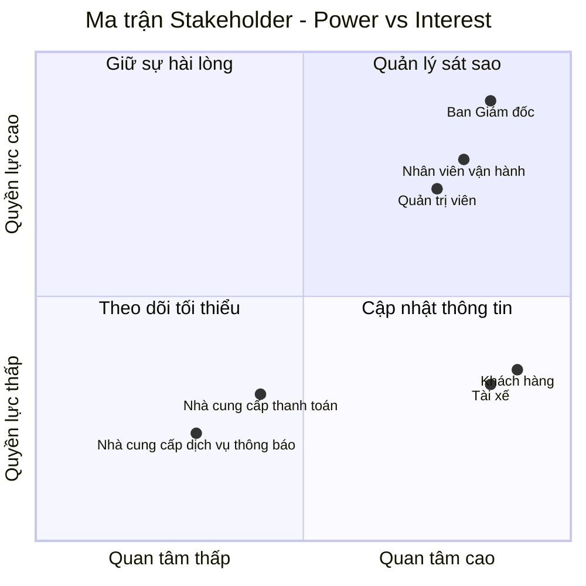

# 23651511_NguyenPhamMaiTrinh_cabsystem
# 1. Hạn chế của hệ thống hiện tại
## a. Các nhược điểm của hệ thống
* Thực hiện thủ công, khách hàng khó theo dõi trạng thái chuyến đi, thông tin thanh toán chưa được quản lý tập trung và bộ phận vận hành gặp khó khăn khi muốn mở rộng hệ thống
## b. Tại sao cần hệ thống mới?
* Đáp ứng quy mô lớn: Phục vụ số lượng lớn khách hàng và tài xế, đồng thời dễ dàng phát triển thêm tính năng trong tương lai.
* Tự động hóa vận hành:Thay thế việc phân công tài xế thủ công bằng cơ chế tự động tìm kiếm, phân phối và xử lý ngoại lệ thông minh.
* Nâng cao trải nghiệm người dùng: Giúp khách hàng theo dõi trực quan trạng thái chuyến đi, còn tài xế dễ dàng nhận/từ chối chuyến xe.
* Quản lý thanh toán tập trung: Tích hợp thanh toán linh hoạt (tiền mặt/điện tử) và bảo mật thông tin nhạy cảm.
* Cải thiện giám sát & báo cáo: Cung cấp giao diện quản trị, thông báo đa kênh và báo cáo hiệu quả hoạt động cho ban lãnh đạo.
* Đảm bảo ổn định & bảo mật: Tăng khả năng mở rộng độc lập từng phần, chống quá tải và bảo mật dữ liệu, phân quyền chặt chẽ.

## 2. Bảng Stakeholder và Vai trò
| STT | Stakeholder | Vai trò |
| :---: | :--- | :--- |
| **1** | Ban Giám đốc | Nhà tài trợ, người ra quyết định|
| **2** | Khách hàng | Người tiêu dùng, người sử dụng cuối|
| **3** | Tài xế | Nhà cung cấp dịch vụ, người thực thi quy trình|
| **4** | Nhân viên vận hành | Người vận hành quy trình|
| **5** | Quản trị viên  | Người kiểm soát quy trình|
| **6** | Nhà cung cấp thanh toán | Nhà cung cấp tích hợp bên ngoài|
| **7** | Nhà cung cấp dịch vụ thông báo | Nhà cung cấp dịch vụ truyền thông bên ngoài|

### Ma trận Matrix

## Giải thích Ma trận
* **Quản lý sát sao:** Ban Giám đốc, Nhân viên vận hành, Quản trị viên. Đây là nhóm có quyền lực cao và mức độ quan tâm cao, cần được trao đổi và phối hợp thường xuyên.
* **Cập nhật thông tin:** Khách hàng, Tài xế. Đây là nhóm có mức độ quan tâm cao nhưng quyền lực thấp, cần được cung cấp thông tin và hỗ trợ thường xuyên.
* **Theo dõi tối thiểu:** Nhà cung cấp thanh toán, Nhà cung cấp dịch vụ thông báo. Đây là các bên cung cấp dịch vụ bên ngoài, có quyền lực và mức độ quan tâm tương đối thấp, chủ yếu cần được theo dõi tình trạng tích hợp và xử lý khi có sự cố.

## 3. Business Purpose
* **Tự động hóa hoạt động đặt và phân công xe:** Tự động tìm kiếm và phân công tài xế phù hợp dựa trên vị trí, trạng thái sẵn sàng và các tiêu chí vận hành được doanh nghiệp xác định, giảm phụ thuộc vào việc phân công thủ công.
* **Nâng cao trải nghiệm khách hàng và tài xế:** Cho phép khách hàng tạo yêu cầu đặt xe, theo dõi trạng thái chuyến đi, biết thông tin tài xế và thời gian dự kiến đến; đồng thời hỗ trợ tài xế nhận hoặc từ chối chuyến.
* **Quản lý tính cước và thanh toán:** Xác định số tiền khách hàng phải thanh toán sau chuyến đi, hỗ trợ thanh toán bằng tiền mặt hoặc phương thức điện tử và ghi nhận kết quả giao dịch.
* **Tăng cường khả năng giám sát và quản trị:** Cung cấp dữ liệu về chuyến đi, tài xế, giao dịch và doanh thu để nhân viên vận hành và ban lãnh đạo theo dõi, xử lý và đánh giá hoạt động.
* **Đảm bảo khả năng mở rộng và ổn định:** Thiết kế hệ thống theo hướng các thành phần có thể mở rộng độc lập, cho phép bổ sung dịch vụ, phương thức thanh toán và nhà cung cấp thông báo trong tương lai mà không phải xây dựng lại toàn bộ hệ thống.

## 4. Xác định phạm vi 7 tuần
### a. Module Quản lý Khách hàng
- **Quy trình Xác thực & Hồ sơ:** Đăng ký, đăng nhập và quản lý thông tin cá nhân.
- **Quy trình Khởi tạo yêu cầu:** Nhập điểm đón, điểm đến, chọn loại xe và gửi yêu cầu đặt xe.
- **Quy trình Theo dõi chuyến:** Theo dõi trạng thái chuyến, thông tin tài xế và thời gian dự kiến đến.
- **Quy trình Lịch sử chuyến:** Xem lịch sử các chuyến đã thực hiện và số tiền phải trả.
- **Quy trình Đánh giá:** Đánh giá tài xế sau khi chuyến hoàn thành.
- **Quy trình Hủy chuyến:** Cho phép khách hàng hủy chuyến theo chính sách của doanh nghiệp.
### b. Module Quản lý Tài xế và Phương tiện
- **Quy trình Quản lý hồ sơ:** Cập nhật thông tin tài xế và phương tiện.
- **Quy trình Quản lý trạng thái:** Cập nhật trạng thái sẵn sàng nhận chuyến.
- **Quy trình Cập nhật vị trí:** Cập nhật vị trí phục vụ việc tìm kiếm và phân công tài xế.
- **Quy trình Thực hiện chuyến:** Nhận/từ chối chuyến và cập nhật trạng thái chuyến.
### c. Module Tìm kiếm và Phân công tài xế
- **Quy trình Tìm tài xế:** Xác định tài xế phù hợp dựa trên vị trí, trạng thái và tiêu chí vận hành.
- **Quy trình Phân công:** Gửi yêu cầu đến tài xế và tiếp tục tìm tài xế khác nếu tài xế từ chối hoặc không phản hồi.
- **Quy trình Xử lý không tìm được tài xế:** Thông báo rõ ràng cho khách hàng.
### d. Module Tính cước và Thanh toán
- **Quy trình Tính cước:** Xác định số tiền khách hàng phải trả dựa trên loại dịch vụ và thông tin chuyến đi.
- **Quy trình Thanh toán:** Hỗ trợ tiền mặt và phương thức điện tử.
- **Quy trình Xử lý thanh toán:** Ghi nhận kết quả và xử lý trường hợp thanh toán điện tử thất bại.
### e. Module Thông báo
- **Thông báo khách hàng:** Thông báo tiếp nhận yêu cầu, tài xế nhận chuyến, tài xế đến điểm đón, chuyến hoàn thành và kết quả thanh toán.
- **Thông báo tài xế:** Thông báo chuyến mới và các thay đổi liên quan đến chuyến
### f. Module Vận hành, Quản trị và Báo cáo
- **Giám sát chuyến đi**
- **Theo dõi trạng thái tài xế**
- **Xử lý trường hợp bất thường**
- **Tra cứu giao dịch**
- **Quản lý tài khoản và phân quyền**
- **Báo cáo hoạt động**
## 5. Chuyển các yêu cầu thành yêu cầu nghiệp vụ
### a. Yêu cầu Quản lý Khách hàng
- **BRa01:** Cho phép khách hàng đăng ký, đăng nhập và quản lý thông tin cá nhân để sử dụng dịch vụ.
- **BRa02:** Hỗ trợ khách hàng tự tạo yêu cầu đặt xe để giảm phụ thuộc vào việc tiếp nhận và điều phối thủ công.
- **BRa03:** Cung cấp khả năng theo dõi trạng thái và thông tin chuyến đi trong quá trình sử dụng dịch vụ.
- **BRa04:** Thu thập đánh giá của khách hàng về tài xế sau khi chuyến đi hoàn thành.
### b. Yêu cầu Quản lý Tài xế và Phương tiện
- **BRb01:** Quản lý thông tin tài xế và phương tiện phục vụ hoạt động cung cấp dịch vụ.
- **BRb02:** Quản lý trạng thái và vị trí của tài xế để phục vụ việc tìm kiếm và phân công chuyến.
- **BRb03:** Cho phép tài xế tiếp nhận hoặc từ chối chuyến và cập nhật trạng thái trong quá trình thực hiện chuyến.
### c. Yêu cầu Tính cước và Thanh toán
- **BRc01:** Xác định số tiền khách hàng phải thanh toán dựa trên loại dịch vụ và thông tin chuyến đi.
- **BRc02:** Cần hỗ trợ thanh toán bằng tiền mặt và phương thức thanh toán điện tử thông qua nhà cung cấp dịch vụ thanh toán.
- **BRc03:** Cần ghi nhận kết quả thanh toán, thông báo khi giao dịch thất bại và hỗ trợ xử lý lại theo chính sách của doanh nghiệp.
### d. Yêu cầu Thông báo
- **BRd01:** Cung cấp thông tin cập nhật cho khách hàng trong các giai đoạn chính của quá trình đặt và thực hiện chuyến.
- **BRd02:** Cung cấp thông tin chuyến xe và các thay đổi liên quan cho tài xế để hỗ trợ quá trình điều phối và thực hiện chuyến.
### e. Yêu cầu Vận hành, Quản trị & Báo cáo
- **BRe01:** Giám sát các chuyến đi, trạng thái tài xế và xử lý các trường hợp bất thường trong quá trình vận hành.
- **BRe02:** Quản lý tài khoản và phân quyền truy cập theo vai trò để bảo vệ dữ liệu và chức năng của hệ thống.
- **BRe03:** Tổng hợp và cung cấp báo cáo về hoạt động chuyến đi, giao dịch và doanh thu để phục vụ công tác quản lý.
## 6. Phân rã yêu cầu chức năng

| STT | Chức năng chính | Chức năng con |
|---|---|---|
| 1 | Quản lý tài khoản và hồ sơ | Đăng ký tài khoản |
|  |  | Đăng nhập |
|  |  | Quản lý hồ sơ |
|  |  | Đăng xuất |
| 2 | Quản lý khách hàng | Đặt xe |
|  |  | Theo dõi chuyến đi |
|  |  | Xem lịch sử chuyến đi |
|  |  | Hủy chuyến |
|  |  | Đánh giá tài xế |
| 3 | Quản lý hoạt động tài xế | Quản lý phương tiện cá nhân |
|  |  | Cập nhật trạng thái hoạt động |
|  |  | Cập nhật vị trí |
|  |  | Nhận chuyến |
|  |  | Từ chối chuyến |
|  |  | Cập nhật trạng thái chuyến |
| 4 | Tính cước và thanh toán | Tính cước và thanh toán |
| 5 | Quản lý vận hành | Quản lý khách hàng |
|  |  | Quản lý tài xế |
|  |  | Quản lý phương tiện |
|  |  | Giám sát chuyến đi |
|  |  | Tra cứu chuyến đi |
|  |  | Theo dõi trạng thái tài xế |
|  |  | Xử lý trường hợp bất thường |
|  |  | Tra cứu lịch sử giao dịch |
| 6 | Báo cáo | Xem báo cáo |
| 7 | Quản trị hệ thống | Quản lý quyền truy cập |
|  |  | Quản lý tài khoản |
  ## 7. Vẽ usecase

  ## 8. Đặc tả usecase
### UC01 – Đăng ký tài khoản
* Actor chính: Người dùng (Khách hàng, Tài xế)
* Mục tiêu : Tạo tài khoản để sử dụng dịch vụ đặt xe
* Tiền điều kiện : Người dùng chưa có tài khoản.
* Hậu điều kiện : Tài khoản Người dùng được tạo thành công.

**Luồng chính:**
| Người dùng | Hệ thống |
|---|---|
| 1. Người dùng chọn chức năng **Đăng ký tài khoản** | 2. Hệ thống hiển thị biểu mẫu đăng ký. |
| 3. Người dùng nhập thông tin cá nhân. | |
| 4. Người dùng gửi yêu cầu đăng ký]. | 5. Hệ thống kiểm tra tính hợp lệ của thông tin. |
| | 6. Hệ thống kiểm tra tài khoản đã tồn tại hay chưa. |
| | 7. Hệ thống tạo tài khoản |
| | 8. Hệ thống thông báo đăng ký thành công. |

**Luồng thay thế/ngoại lệ:**
- **5a.** Thông tin không hợp lệ → Hệ thống yêu cầu nhập lại.
- **6a.** Tài khoản đã tồn tại → Hệ thống thông báo và yêu cầu sử dụng thông tin khác.
- **7a.** Lỗi hệ thống → Không tạo được tài khoản.

### UC02 – Đăng nhập
* Actor chính: Người dùng (Khách hàng, Tài xế, Nhân viên vận hành, Quản trị viên)
* Mục tiêu : Xác thực người dùng trước khi sử dụng các chức năng yêu cầu tài khoản.
* Tiền điều kiện : Người dùng đã có tài khoản.
* Hậu điều kiện : Người dùng đăng nhập thành công.
  
**Luồng chính:**
| Người dùng | Hệ thống |
|---|---|
| 1. Người dùng chọn **Đăng nhập** | 2. Hệ thống hiển thị biểu mẫu đăng nhập. |
| 3. Người dùng nhập thông tin đăng nhập. | |
| 4. Người dùng gửi yêu cầu. | 5. Hệ thống kiểm tra thông tin. |
| | 6. Hệ thống xác thực tài khoản. |
| | 7. Hệ thống cho phép người dùng truy cập. |

**Luồng thay thế/ngoại lệ:**
- **5a.** Sai thông tin đăng nhập → Hệ thống thông báo lỗi.
- **6a.** Tài khoản không hợp lệ/bị khóa → Hệ thống từ chối đăng nhập.

### UC03 – Quản lý hồ sơ
* Actor chính: Người dùng (Khách hàng, Tài xế)
* Mục tiêu : Cho phép người dùng cập nhật thông tin cá nhân.
* Tiền điều kiện : Người dùng đã đăng nhập vào hệ thống.
* Hậu điều kiện : Thông tin cá nhân được cập nhật thành công.

**Luồng chính:**
| Người dùng | Hệ thống |
|---|---|
| 1. Người dùng chọn mục **Hồ sơ cá nhân**. | 2. Hệ thống hiển thị thông tin hiện tại của người dùng. |
| 3. Người dùng chọn chỉnh sửa. | |
| 4. Người dùng cập nhật thông tin mới. | |
| 5. Người dùng xác nhận lưu thay đổi. | 6. Hệ thống kiểm tra tính hợp lệ của thông tin. |
| | 7. Hệ thống lưu thông tin mới vào cơ sở dữ liệu |
| | 8. Hệ thống thông báo cập nhật thành công. |

**Luồng thay thế/ngoại lệ:**
- **6a.** Thông tin không hợp lệ → Hệ thống yêu cầu người dùng nhập lại.
- **7a.** Lỗi lưu dữ liệu → Hệ thống thông báo cập nhật thất bại và yêu cầu thử lại.

## 1. Khách hàng
### UC04 – Đặt xe
* **Actor chính:** Khách hàng
* **Mục tiêu:** Cho phép khách hàng tạo yêu cầu đặt xe.
* **Tiền điều kiện:** Khách hàng đã đăng nhập.
* **Hậu điều kiện:** Yêu cầu đặt xe được tạo và hệ thống bắt đầu tìm tài xế.

**Luồng chính:**

| Khách hàng | Hệ thống |
|---|---|
| 1. Khách hàng chọn chức năng **Đặt xe**. | 2. Hệ thống hiển thị giao diện đặt xe. |
| 3. Khách hàng nhập điểm đón. | |
| 4. Khách hàng nhập điểm đến. | |
| 5. Khách hàng lựa chọn loại xe. | 6. Hệ thống kiểm tra thông tin chuyến. |
| 7. Khách hàng xác nhận yêu cầu đặt xe. | 8. Hệ thống tiếp nhận và tạo yêu cầu đặt xe. |
| | 9. Hệ thống bắt đầu tìm tài xế phù hợp. |
| | 10. Hệ thống thông báo đã tìm được tài xế cho khách hàng. |

**Luồng thay thế/ngoại lệ:**
- **3a.** Điểm đón không hợp lệ → Hệ thống yêu cầu khách hàng nhập lại.
- **4a.** Điểm đến không hợp lệ → Hệ thống yêu cầu khách hàng nhập lại.
- **9a.** Không tìm được tài xế phù hợp → Hệ thống thông báo rõ ràng cho khách hàng.

### UC05 – Theo dõi chuyến đi
* Actor chính: Khách hàng
* Mục tiêu : Cho phép khách hàng theo dõi trạng thái chuyến và tài xế.
* Tiền điều kiện : Khách hàng đã tạo yêu cầu đặt xe.
* Hậu điều kiện : Thông tin trạng thái chuyến được hiển thị.

**Luồng chính:**
| Khách hàng | Hệ thống |
|---|---|
| 1. Khách hàng mở thông tin chuyến. | 2. Hệ thống hiển thị trạng thái tìm tài xế. |
| | 3. Khi tài xế nhận chuyến, hệ thống hiển thị thông tin tài xế. |
| | 4. Hệ thống hiển thị thời gian dự kiến tài xế đến. |
| | 5. Khi tài xế đến điểm đón, hệ thống cập nhật trạng thái. |
| | 6. Hệ thống tiếp tục cập nhật trạng thái trong quá trình thực hiện chuyến. |
| | 7. Khi chuyến hoàn thành, hệ thống thông báo trạng thái hoàn thành. |

**Luồng thay thế/ngoại lệ:**
- **3a.** Chưa có tài xế nhận chuyến → Hệ thống tiếp tục hiển thị trạng thái tìm tài xế.
- **4a.** Không xác định được thời gian dự kiến → Hệ thống thông báo dữ liệu chưa khả dụng.

### UC06 – Xem lịch sử chuyến đi
* Actor chính: Khách hàng
* Mục tiêu : Xem lại các chuyến đã thực hiện.
* Tiền điều kiện : Khách hàng đã đăng nhập.
* Hậu điều kiện : Lịch sử chuyến được hiển thị.

**Luồng chính:**
| Khách hàng | Hệ thống |
|---|---|
| 1. Khách hàng chọn **Lịch sử chuyến đi**. | 2. Hệ thống truy xuất lịch sử. |
| | 3. Hệ thống hiển thị danh sách chuyến. |
| 4. Khách hàng chọn một chuyến. | 5. Hệ thống hiển thị chi tiết chuyến. |
| | 6. Hệ thống hiển thị số tiền phải trả. |

**Luồng thay thế/ngoại lệ:**
- **2a.** Không có chuyến → Hệ thống thông báo chưa có lịch sử.
- **2b.** Lỗi truy xuất dữ liệu → Hệ thống thông báo không thể tải dữ liệu.

### UC07 – Tính cước và thanh toán
* **Actor chính:** Khách hàng
* **Actor phụ:** Nhà cung cấp thanh toán bên ngoài
* **Mục tiêu:** Xác định số tiền phải trả và thực hiện thanh toán chi phí chuyến đi.
* **Tiền điều kiện:** Chuyến đi đã hoàn thành.
* **Hậu điều kiện:** Số tiền phải trả và kết quả thanh toán được ghi nhận.

**Luồng chính:**

| Khách hàng | Hệ thống | Nhà cung cấp thanh toán |
|---|---|---|
| | 1. Hệ thống nhận thông tin chuyến đi đã hoàn thành. | |
| | 2. Hệ thống thông báo chuyến đi đã hoàn thành cho khách hàng. | |
| | 3. Hệ thống xác định số tiền khách hàng phải trả dựa trên loại dịch vụ và thông tin chuyến đi. | |
| | 4. Hệ thống hiển thị số tiền phải thanh toán. | |
| 5. Khách hàng chọn phương thức thanh toán. | | |
| | 6. Nếu chọn **tiền mặt**, hệ thống ghi nhận thanh toán tiền mặt. | |
| | 7. Nếu chọn **thanh toán điện tử**, hệ thống gửi yêu cầu thanh toán. | |
| | | 8. Nhà cung cấp thanh toán xử lý giao dịch. |
| | | 9. Nhà cung cấp trả kết quả giao dịch cho hệ thống. |
| | 10. Hệ thống cập nhật trạng thái thanh toán và thông báo cho khách hàng. | |

**Luồng thay thế/ngoại lệ:**
- **7a.** Thanh toán điện tử thất bại → Hệ thống thông báo cho khách hàng chọn phương thức khác hoặc thanh toán lại
- **9a.** Không nhận được kết quả từ nhà cung cấp → Hệ thống xử lý theo cơ chế của doanh nghiệp.

### UC08 – Đánh giá tài xế
* Actor chính: Khách hàng
* Mục tiêu : Cho phép khách hàng đánh giá tài xế sau chuyến đi.
* Tiền điều kiện : Chuyến đi đã hoàn thành.
* Hậu điều kiện : Đánh giá được lưu vào hệ thống.

**Luồng chính:**
| Khách hàng | Hệ thống |
|---|---|
| 1. Khách hàng mở chuyến đã hoàn thành. | 2. Hệ thống hiển thị chức năng đánh giá. |
| 3. Khách hàng thực hiện đánh giá tài xế. | |
| 4. Khách hàng gửi đánh giá. | 5. Hệ thống kiểm tra thông tin. |
| | 6. Hệ thống lưu đánh giá. |
| | 7. Hệ thống thông báo đánh giá thành công. |

**Luồng thay thế/ngoại lệ:**
- **1a.** Chuyến chưa hoàn thành → Hệ thống không cho phép đánh giá.
- **5a.** Thông tin đánh giá không hợp lệ → Hệ thống yêu cầu nhập lại.

### UC09 – Hủy chuyến
* **Actor chính:** Khách hàng
* **Mục tiêu:** Cho phép khách hàng hủy yêu cầu đặt xe khi chuyến đi chưa bắt đầu.
* **Tiền điều kiện:** Khách hàng đã đăng nhập và có chuyến chưa bắt đầu.
* **Hậu điều kiện:** Chuyến được cập nhật sang trạng thái đã hủy và các bên liên quan được thông báo.

**Luồng chính:**

| Khách hàng | Hệ thống |
|---|---|
| 1. Khách hàng mở thông tin chuyến cần hủy. | 2. Hệ thống hiển thị thông tin và trạng thái hiện tại của chuyến. |
| 3. Khách hàng chọn chức năng **Hủy chuyến**. | 4. Hệ thống kiểm tra trạng thái chuyến. |
| 5. Khách hàng xác nhận hủy chuyến. | 6. Hệ thống cập nhật trạng thái chuyến thành **Đã hủy**. |
| | 7. Hệ thống thông báo kết quả hủy chuyến cho khách hàng và tài xế nếu chuyến đã được phân công. |

**Luồng thay thế/ngoại lệ:**
- **4a.** Chuyến đã bắt đầu hoặc không còn đủ điều kiện hủy → Hệ thống không cho phép hủy và thông báo cho khách hàng.
- **5a.** Khách hàng không xác nhận hủy → Hệ thống giữ nguyên trạng thái chuyến.
- **6a.** Không thể cập nhật trạng thái chuyến → Hệ thống thông báo hủy chuyến không thành công.
- 
# 2. TÀI XẾ
### UC10 – Quản lý phương tiện cá nhân
* Actor chính: Tài xế
* Mục tiêu : Cho phép tài xế quản lý thông tin phương tiện của mình.
* Tiền điều kiện : Tài xế đã đăng nhập.
* Hậu điều kiện : Thông tin phương tiện được cập nhật.

**Luồng chính:**
| Tài xế | Hệ thống |
|---|---|
| 1. Tài xế chọn **Quản lý phương tiện**. | 2. Hệ thống hiển thị thông tin phương tiện. |
| 3. Tài xế thêm hoặc cập nhật thông tin. | |
| 4. Tài xế xác nhận. | 5. Hệ thống kiểm tra. |
| | 6. Hệ thống lưu thông tin. |
| | 7. Hệ thống thông báo thành công. |

**Luồng thay thế/ngoại lệ:**
- **5a.** Thông tin không hợp lệ → Hệ thống yêu cầu nhập lại.
- **5b.** Phương tiện không đáp ứng yêu cầu → Hệ thống thông báo.

### UC11 – Cập nhật trạng thái hoạt động
* Actor chính: Tài xế
* Mục tiêu : Cho phép tài xế chuyển sang trạng thái sẵn sàng nhận chuyến.
* Tiền điều kiện : Tài xế đã đăng nhập.
* Hậu điều kiện : Trạng thái hoạt động được cập nhật.

**Luồng chính:**
| Tài xế | Hệ thống |
|---|---|
| 1. Tài xế mở trạng thái hoạt động. | 2. Hệ thống hiển thị trạng thái hiện tại. |
| 3. Tài xế chọn **Sẵn sàng nhận chuyến**. | 4. Hệ thống cập nhật trạng thái. |
| | 5. Hệ thống đưa tài xế vào danh sách có thể nhận chuyến. |

**Luồng thay thế/ngoại lệ:**
- **4a.** Tài xế không đủ điều kiện hoạt động → Hệ thống không cho phép chuyển trạng thái.

### UC12 – Cập nhật vị trí
* Actor chính: Tài xế
* Mục tiêu : Lưu vị trí tài xế để hỗ trợ tìm tài xế và dự kiến thời gian đến.
* Tiền điều kiện : Tài xế đã đăng nhập và cho phép hệ thống truy cập vị trí.
* Hậu điều kiện : Vị trí tài xế được cập nhật.

**Luồng chính:**
| Tài xế | Hệ thống |
|---|---|
| | 1. Hệ thống yêu cầu quyền truy cập vị trí. |
| 2. Tài xế cho phép truy cập. | |
| | 3. Hệ thống lấy vị trí hiện tại. |
| | 4. Hệ thống lưu/cập nhật vị trí. |
| | 5. Hệ thống sử dụng vị trí để hỗ trợ tìm tài xế phù hợp. |

**Luồng thay thế/ngoại lệ:**
- **2a.** Tài xế không cấp quyền truy cập vị trí → Hệ thống không thể cập nhật vị trí.
- **3a.** Không xác định được vị trí → Hệ thống thông báo lỗi.

### UC13 – Nhận chuyến
* Actor chính: Tài xế
* Mục tiêu : Cho phép tài xế nhận yêu cầu chuyến phù hợp.
* Tiền điều kiện : Tài xế đang ở trạng thái sẵn sàng nhận chuyến.
* Hậu điều kiện : Chuyến được gán cho tài xế.

**Luồng chính:**
| Tài xế | Hệ thống |
|---|---|
| | 1. Hệ thống xác định chuyến phù hợp. |
| | 2. Hệ thống gửi thông báo chuyến mới cho tài xế. |
| 3. Tài xế xem thông tin chuyến. | |
| 4. Tài xế chọn Chấp nhận. | 5. Hệ thống kiểm tra chuyến. |
| | 6. Hệ thống gán chuyến cho tài xế. |
| | 7. Hệ thống cập nhật trạng thái chuyến. |
| | 8. Hệ thống thông báo cho khách hàng. |

**Luồng thay thế/ngoại lệ:**
- **5a.** Chuyến đã được tài xế khác nhận → Hệ thống thông báo chuyến không còn khả dụng.
- **4a.** Tài xế không phản hồi trong thời gian quy định → Hệ thống xử lý như không nhận chuyến.

### UC14 – Từ chối chuyến
* Actor chính: Tài xế
* Mục tiêu : Cho phép tài xế từ chối chuyến được đề xuất.
* Tiền điều kiện : Tài xế nhận được yêu cầu chuyến.
* Hậu điều kiện : Chuyến được trả lại cho cơ chế tìm tài xế.

**Luồng chính:**
| Tài xế | Hệ thống |
|---|---|
| | 1. Hệ thống gửi thông báo chuyến mới. |
| 2. Tài xế xem thông tin. | |
| 3. Tài xế chọn **Từ chối**. | 4. Hệ thống ghi nhận kết quả. |
| | 5. Hệ thống tiếp tục tìm tài xế phù hợp khác. |
| | 6. Khách hàng không cần tạo lại yêu cầu. |

**Luồng thay thế/ngoại lệ:**
- **5a.** Không có tài xế khác phù hợp → Hệ thống thông báo cho khách hàng.

### UC15 – Cập nhật trạng thái chuyến
* **Actor chính:** Tài xế
* **Mục tiêu:** Cập nhật tiến trình thực hiện chuyến.
* **Tiền điều kiện:** Tài xế đã nhận chuyến và chuyến đang ở trạng thái cho phép cập nhật.
* **Hậu điều kiện:** Trạng thái chuyến được cập nhật và khách hàng nhận được thông tin.

**Luồng chính:**

| Tài xế | Hệ thống |
|---|---|
| 1. Tài xế nhận chuyến. | |
| 2. Tài xế di chuyển đến điểm đón. | |
| 3. Tài xế cập nhật trạng thái **Đã đến điểm đón**. | 4. Hệ thống kiểm tra, cập nhật trạng thái và thông báo cho khách hàng. |
| 5. Tài xế đón khách. | |
| 6. Tài xế cập nhật trạng thái **Đã đón khách**. | 7. Hệ thống kiểm tra và cập nhật trạng thái chuyến. |
| 8. Tài xế bắt đầu di chuyển. | |
| 9. Tài xế cập nhật trạng thái **Đang di chuyển**. | 10. Hệ thống kiểm tra và cập nhật trạng thái chuyến. |
| 11. Tài xế đến điểm trả. | |
| 12. Tài xế cập nhật trạng thái **Hoàn thành chuyến**. | 13. Hệ thống kiểm tra, cập nhật trạng thái và thông báo cho khách hàng. |

**Luồng thay thế/ngoại lệ:**
- **4a.** Mất kết nối khi cập nhật trạng thái **Đã đến điểm đón** → Hệ thống xử lý theo chính sách của doanh nghiệp.
- **7a.** Mất kết nối khi cập nhật trạng thái **Đã đón khách** → Hệ thống xử lý theo chính sách của doanh nghiệp.
- **10a.** Mất kết nối khi cập nhật trạng thái **Đang di chuyển** → Hệ thống xử lý theo chính sách của doanh nghiệp.
- **13a.** Mất kết nối khi cập nhật trạng thái **Hoàn thành chuyến** → Hệ thống xử lý theo chính sách của doanh nghiệp.

# 3. NHÂN VIÊN VẬN HÀNH
### UC16 – Quản lý khách hàng
* Actor chính: Nhân viên vận hành
* Mục tiêu : Quản lý thông tin khách hàng trong hệ thống.
* Tiền điều kiện : Nhân viên vận hành đã đăng nhập và có quyền phù hợp.
* Hậu điều kiện : Thông tin khách hàng được xem hoặc cập nhật.

**Luồng chính:**
| Nhân viên vận hành | Hệ thống |
|---|---|
| 1. Nhân viên chọn **Quản lý khách hàng**. | 2. Hệ thống hiển thị danh sách khách hàng. |
| 3. Nhân viên tìm kiếm khách hàng. | 4. Hệ thống hiển thị thông tin. |
| 5. Nhân viên thực hiện thao tác được cấp quyền. | 6. Hệ thống kiểm tra quyền. |
| | 7. Hệ thống lưu thay đổi nếu có. |
| | 8. Hệ thống thông báo kết quả. |

**Luồng thay thế/ngoại lệ:**
- **4a.** Không tìm thấy khách hàng → Hệ thống thông báo.
- **6a.** Không đủ quyền → Hệ thống từ chối thao tác.

### UC17 – Quản lý tài xế
* Actor chính: Nhân viên vận hành
* Mục tiêu : Quản lý tài xế và hỗ trợ tạo tài khoản tài xế.
* Tiền điều kiện : Nhân viên vận hành đã đăng nhập.
* Hậu điều kiện : Thông tin tài xế được cập nhật.

**Luồng chính:**
| Nhân viên vận hành | Hệ thống |
|---|---|
| 1. Nhân viên chọn **Quản lý tài xế**. | 2. Hệ thống hiển thị danh sách tài xế. |
| 3. Nhân viên tìm kiếm tài xế. | |
| 4. Nhân viên xem hoặc cập nhật thông tin. | |
| 5. Nếu cần, nhân viên tạo tài khoản cho tài xế. | 6. Hệ thống kiểm tra dữ liệu. |
| | 7. Hệ thống lưu thông tin. |
| | 8. Hệ thống thông báo kết quả. |

**Luồng thay thế/ngoại lệ:**
- **6a.** Thông tin không hợp lệ → Hệ thống yêu cầu nhập lại.
- **6b.** Tài khoản đã tồn tại → Hệ thống thông báo.
- **6c.** Không đủ quyền → Hệ thống từ chối thao tác.

### UC18 – Quản lý phương tiện
* Actor chính: Nhân viên vận hành
* Mục tiêu : Quản lý thông tin phương tiện trong hệ thống.
* Tiền điều kiện : Nhân viên vận hành đã đăng nhập.
* Hậu điều kiện : Thông tin phương tiện được cập nhật.

**Luồng chính:**
| Nhân viên vận hành | Hệ thống |
|---|---|
| 1. Nhân viên chọn **Quản lý phương tiện**. | 2. Hệ thống hiển thị danh sách phương tiện. |
| 3. Nhân viên tìm kiếm phương tiện. | |
| 4. Nhân viên xem hoặc cập nhật thông tin. | 5. Hệ thống kiểm tra dữ liệu. |
| | 6. Hệ thống lưu thay đổi. |
| | 7. Hệ thống thông báo kết quả. |

**Luồng thay thế/ngoại lệ:**
- **5a.** Phương tiện không tồn tại → Hệ thống thông báo.
- **5b.** Dữ liệu không hợp lệ → Hệ thống yêu cầu nhập lại.
- **5c.** Không đủ quyền → Hệ thống từ chối.

### UC19 – Giám sát chuyến đi
* Actor chính: Nhân viên vận hành
* Mục tiêu : Theo dõi các chuyến đang diễn ra.
* Tiền điều kiện : Nhân viên vận hành đã đăng nhập.
* Hậu điều kiện : Thông tin chuyến được hiển thị để hỗ trợ vận hành.

**Luồng chính:**
| Nhân viên vận hành | Hệ thống |
|---|---|
| 1. Nhân viên chọn **Giám sát chuyến đi**. | 2. Hệ thống hiển thị các chuyến đang diễn ra. |
| 3. Nhân viên chọn chuyến cần theo dõi. | 4. Hệ thống hiển thị tài xế, trạng thái và thông tin chuyến. |
| | 5. Hệ thống cập nhật dữ liệu. |
| 6. Nhân viên theo dõi và hỗ trợ khi cần. | |

**Luồng thay thế/ngoại lệ:**
- **2a.** Không có chuyến đang diễn ra → Hệ thống thông báo.
- **5a.** Dữ liệu không cập nhật → Hệ thống hiển thị dữ liệu gần nhất.

### UC20 – Theo dõi trạng thái tài xế
* Actor chính: Nhân viên vận hành
* Mục tiêu : Kiểm tra trạng thái hoạt động của tài xế.
* Tiền điều kiện : Nhân viên vận hành đã đăng nhập.
* Hậu điều kiện : Trạng thái tài xế được hiển thị.

**Luồng chính:**
| Nhân viên vận hành | Hệ thống |
|---|---|
| 1. Nhân viên chọn **Theo dõi trạng thái tài xế**. | 2. Hệ thống hiển thị danh sách tài xế. |
| | 3. Hệ thống hiển thị trạng thái hoạt động. |
| 4. Nhân viên chọn tài xế cần xem. | 5. Hệ thống hiển thị vị trí và chuyến đang thực hiện nếu có. |
| 6. Nhân viên theo dõi trạng thái. | |

**Luồng thay thế/ngoại lệ:**
- **2a.** Không tìm thấy tài xế → Hệ thống thông báo.
- **5a.** Không có dữ liệu vị trí → Hệ thống hiển thị trạng thái gần nhất.

### UC21 – Xử lý trường hợp bất thường
* Actor chính: Nhân viên vận hành
* Mục tiêu : Hỗ trợ xử lý các chuyến bị lỗi hoặc trường hợp bất thường.
* Tiền điều kiện : Có chuyến hoặc trường hợp cần hỗ trợ.
* Hậu điều kiện : Trường hợp được xử lý hoặc chuyển cấp.

**Luồng chính:**
| Nhân viên vận hành | Hệ thống |
|---|---|
| 1. Nhân viên nhận thông tin trường hợp bất thường. | |
| 2. Nhân viên mở thông tin chuyến. | 3. Hệ thống hiển thị dữ liệu liên quan. |
| 4. Nhân viên kiểm tra nguyên nhân. | |
| 5. Nhân viên thực hiện phương án xử lý. | 6. Hệ thống cập nhật kết quả. |
| | 7. Hệ thống lưu vết thao tác. |

**Luồng thay thế/ngoại lệ:**
- **3a.** Thiếu thông tin → Hệ thống yêu cầu bổ sung.
- **5a.** Không thể xử lý → Chuyển cấp có thẩm quyền.
- **6a.** Lỗi hệ thống → Hệ thống ghi nhận để xử lý.

### UC22 – Tra cứu lịch sử giao dịch
* Actor chính: Nhân viên vận hành
* Mục tiêu : Tra cứu lịch sử giao dịch thanh toán.
* Tiền điều kiện : Nhân viên đã đăng nhập và có quyền tra cứu.
* Hậu điều kiện : Thông tin giao dịch được hiển thị.

**Luồng chính:**
| Nhân viên vận hành | Hệ thống |
|---|---|
| 1. Nhân viên chọn **Tra cứu giao dịch**. | 2. Hệ thống hiển thị giao diện tra cứu. |
| 3. Nhân viên nhập điều kiện tìm kiếm. | 4. Hệ thống truy xuất dữ liệu. |
| | 5. Hệ thống hiển thị danh sách giao dịch. |
| 6. Nhân viên chọn giao dịch. | 7. Hệ thống hiển thị chi tiết. |

**Luồng thay thế/ngoại lệ:**
- **4a.** Không tìm thấy giao dịch → Hệ thống thông báo.
- **4b.** Lỗi truy xuất dữ liệu → Hệ thống thông báo lỗi.
- **2a.** Không đủ quyền → Hệ thống từ chối truy cập.

### UC23 – Tra cứu chuyến đi
* **Actor chính:** Nhân viên vận hành
* **Mục tiêu:** Cho phép nhân viên vận hành tra cứu thông tin các chuyến đi trong hệ thống.
* **Tiền điều kiện:** Nhân viên vận hành đã đăng nhập và có quyền truy cập.
* **Hậu điều kiện:** Thông tin chuyến đi phù hợp với điều kiện tìm kiếm được hiển thị.

**Luồng chính:**

| Nhân viên vận hành | Hệ thống |
|---|---|
| 1. Nhân viên chọn chức năng **Tra cứu chuyến đi**. | 2. Hệ thống hiển thị giao diện tra cứu. |
| 3. Nhân viên nhập điều kiện tìm kiếm. | 4. Hệ thống truy xuất dữ liệu chuyến đi. |
| | 5. Hệ thống hiển thị danh sách chuyến phù hợp. |
| 6. Nhân viên chọn chuyến cần xem. | 7. Hệ thống hiển thị thông tin chi tiết chuyến đi. |

**Luồng thay thế/ngoại lệ:**
- **4a.** Không tìm thấy chuyến phù hợp → Hệ thống thông báo không có dữ liệu.
- **4b.** Lỗi truy xuất dữ liệu → Hệ thống thông báo không thể tải dữ liệu.

# 4. QUẢN TRỊ VIÊN
### UC24 – Xem báo cáo
* Actor chính: Quản trị viên
* Mục tiêu : Theo dõi dữ liệu hoạt động của hệ thống.
* Tiền điều kiện : Người dùng có quyền xem báo cáo.
* Hậu điều kiện : Báo cáo được hiển thị.

**Luồng chính:**
| Quản trị viên | Hệ thống |
|---|---|
| 1. Người dùng chọn **Báo cáo**. | 2. Hệ thống hiển thị các loại báo cáo gồm số lượng chuyến, doanh thu, tỷ lệ hoàn thành, tỷ lệ hủy và hiệu quả hoạt động của tài xế. |
| 3. Người dùng chọn loại báo cáo. | |
| 4. Chọn khoảng thời gian và điều kiện lọc. | 5. Hệ thống truy xuất dữ liệu. |
| | 6. Hệ thống tổng hợp dữ liệu. |
| | 7. Hệ thống hiển thị báo cáo. |

**Luồng thay thế/ngoại lệ:**
- **5a.** Không có dữ liệu → Hệ thống thông báo.
- **5b.** Điều kiện lọc không hợp lệ → Hệ thống yêu cầu nhập lại.

### UC25 – Quản lý quyền truy cập
* Actor chính: Quản trị viên
* Mục tiêu : Phân quyền và quản lý quyền hạn truy cập của các tài khoản trong hệ thống.
* Tiền điều kiện : Quản trị viên đã đăng nhập với quyền cao nhất.
* Hậu điều kiện : Quyền hạn của tài khoản được cập nhật và ghi nhận.

**Luồng chính:**
| Quản trị viên | Hệ thống |
|---|---|
| 1. Quản trị viên chọn **Quản lý quyền truy cập**. | 2. Hệ thống hiển thị danh sách vai trò và quyền hạn tương ứng. |
| 3. Quản trị viên chọn vai trò hoặc tài khoản cần phân quyền. | 4. Hệ thống hiển thị chi tiết các quyền hiện tại. |
| 5. Quản trị viên khóa hoặc chỉnh sửa quyền. | 6. Hệ thống kiểm tra tính hợp lệ của phân quyền. |
| 7. Quản trị viên xác nhận lưu thay đổi. | 8. Hệ thống lưu cấu hình quyền mới. |
| | 9. Hệ thống thông báo cập nhật quyền thành công. |

**Luồng thay thế/ngoại lệ:**
- **6a.** Xung đột hoặc không đủ thẩm quyền → Hệ thống từ chối thay đổi và hiển thị cảnh báo.
- **8a.** Lỗi hệ thống khi lưu → Hệ thống thông báo lỗi và yêu cầu thực hiện lại.

### UC26 – Quản lý tài khoản
* Actor chính: Quản trị viên
* Mục tiêu : Tạo mới, khóa, mở khóa hoặc cập nhật thông tin tổng quan của các tài khoản (khách hàng, tài xế, nhân viên).
* Tiền điều kiện : Quản trị viên đã đăng nhập và có quyền quản lý tài khoản.
* Hậu điều kiện : Trạng thái hoặc thông tin tài khoản được cập nhật trong hệ thống.

**Luồng chính:**
| Quản trị viên | Hệ thống |
|---|---|
| 1. Quản trị viên chọn **Quản lý tài khoản**. | 2. Hệ thống hiển thị danh sách tài khoản toàn hệ thống. |
| 3. Quản trị viên tìm kiếm và chọn tài khoản cần thao tác. | 4. Hệ thống hiển thị thông tin chi tiết tài khoản. |
| 5. Quản trị viên chọn hành động (Thêm mới, Khóa/Mở khóa, Cập nhật thông tin). | 6. Hệ thống kiểm tra dữ liệu hoặc trạng thái yêu cầu. |
| 7. Quản trị viên xác nhận thực thi. | 8. Hệ thống thực hiện thay đổi dữ liệu tài khoản. |
| | 9. Hệ thống thông báo kết quả thành công. |

**Luồng thay thế/ngoại lệ:**
- **5a.** Tài khoản đã tồn tại khi tạo mới → Hệ thống thông báo trùng lặp.
- **6a.** Dữ liệu nhập vào không hợp lệ → Hệ thống yêu cầu kiểm tra và nhập lại.
- **8a.** Không đủ quyền hạn thao tác → Hệ thống từ chối thực hiện.

### UC27 – Đăng xuất
* Actor chính: Người dùng (Khách hàng, Tài xế, Nhân viên vận hành, Quản trị viên)
* Mục tiêu: Kết thúc phiên đăng nhập và thoát khỏi hệ thống.
* Tiền điều kiện: Người dùng đã đăng nhập.
* Hậu điều kiện: Phiên đăng nhập của Người dùng được kết thúc.

**Luồng chính:**
| Người dùng | Hệ thống |
|---|---|
| 1. Người dùng chọn chức năng **Đăng xuất**. | 2. Hệ thống hiển thị yêu cầu xác nhận đăng xuất. |
| 3. Người dùng xác nhận đăng xuất. | 4. Hệ thống kết thúc phiên đăng nhập của Người dùng. |
| | 5. Hệ thống chuyển Người dùng về màn hình đăng nhập. |

**Luồng thay thế/ngoại lệ:**
- **3a.** Người dùng hủy đăng xuất → Hệ thống giữ nguyên phiên đăng nhập.
- **4a.** Lỗi hệ thống → Hệ thống thông báo không thể đăng xuất, Người dùng có thể thực hiện lại.

  ## 9. Phân tích quy trình nghiệp vụ
  ### 9.1. Activity Diagram – UC04: Đặt xe
  

  ### 9.2. Activity Diagram – UC07: Tính cước và thanh toán
  

  ## 10. Phân tích nguyên tắc nghiệp vụ
* **Quy tắc Phân công và Xử lý từ chối:** Hệ thống ưu tiên lựa chọn tài xế phù hợp dựa trên vị trí, trạng thái sẵn sàng và các tiêu chí vận hành được doanh nghiệp xác định. Nếu tài xế được đề xuất từ chối hoặc không phản hồi trong thời gian giới hạn, hệ thống phải tự động chuyển tiếp sang tài xế tiếp theo mà không làm gián đoạn hoặc yêu cầu khách hàng phải tạo lại yêu cầu.
* **Quy tắc Tách biệt Dữ liệu Thanh toán & Bảo mật:** Tuyệt đối không lưu trữ trực tiếp thông tin nhạy cảm của thẻ hoặc tài khoản thanh toán nội bộ bên trong hệ thống CAB System. Mọi giao dịch điện tử phải được thực hiện thông qua liên kết bảo mật với nhà cung cấp cổng thanh toán độc lập bên ngoài.
* **Quy tắc Phân quyền và Kiểm soát Truy cập RBAC:** Mọi tác nhân (Khách hàng, Tài xế, Nhân viên vận hành) phải đi qua cổng định danh và xác thực an toàn. Các thao tác quản trị hệ thống nhạy cảm phải được phân quyền chặt chẽ theo vai trò (RBAC) để bảo vệ dữ liệu cá nhân, phương tiện và giao dịch.
* **Quy tắc Kiến trúc Độc lập & Ổn định:** Các thành phần chức năng (như Thanh toán, Thông báo, Đặt xe) phải được thiết kế dạng module mở rộng độc lập. Khi một sự cố xảy ra ở module phụ trợ (ví dụ lỗi cổng thanh toán hoặc lỗi gửi thông báo), hệ thống không được làm ngưng trệ toàn bộ nền tảng đặt xe và cho phép triển khai nâng cấp từng phần.
  
