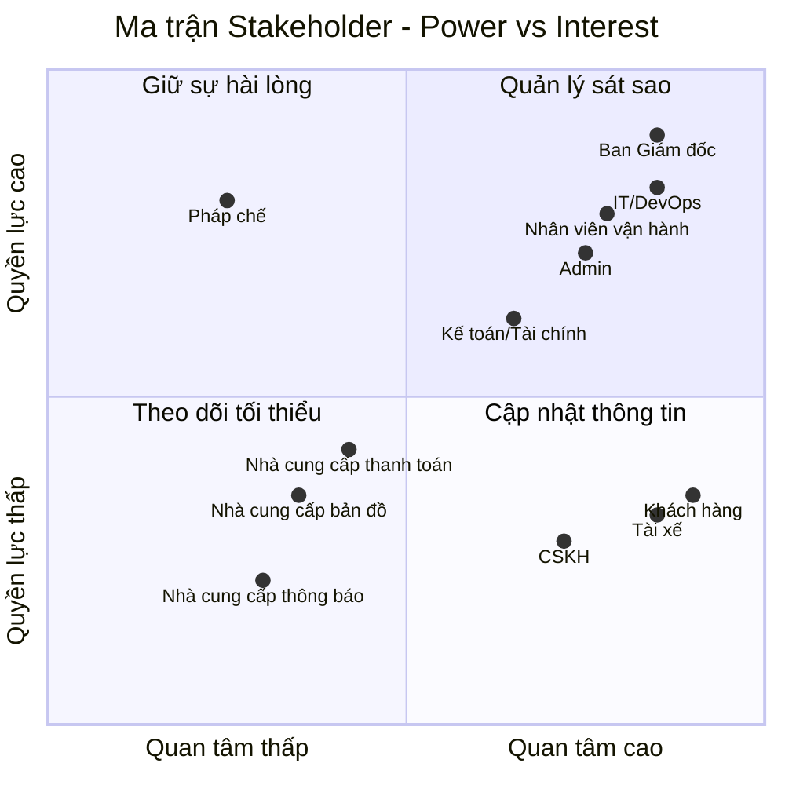
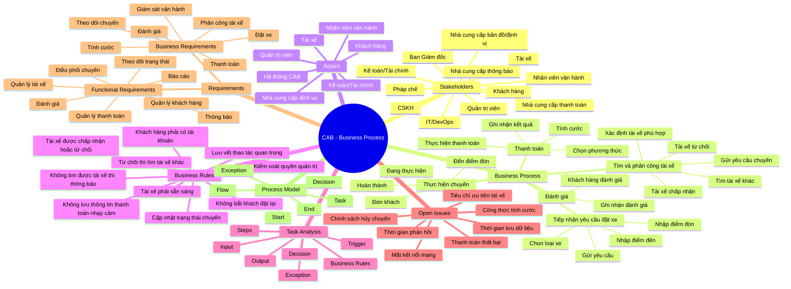

# 23651511_NguyenPhamMaiTrinh_cabsystem
# 1. Hạn chế của hệ thống hiện tại
## a. Các yêu điểm của hệ thống
* Thực hiện thủ công, khách hàng khó theo dõi trạng thái chuyến đi, thông tin thanh toán chưa được quản lý tập trung và bộ phận vận hành gặp khó khăn khi muốn mở rộng hệ thống
## b. Tại sao cần hệ thống mới?
* Đáp ứng quy mô lớn: Phục vụ số lượng lớn khách hàng và tài xế, đồng thời dễ dàng phát triển thêm tính năng trong tương lai.
* Tự động hóa vận hành:Thay thế việc phân công tài xế thủ công bằng cơ chế tự động tìm kiếm, phân phối và xử lý ngoại lệ thông minh.
* Nâng cao trải nghiệm người dùng: Giúp khách hàng theo dõi trực quan trạng thái chuyến đi, còn tài xế dễ dàng nhận/từ chối chuyến xe.
* Quản lý thanh toán tập trung: Tích hợp thanh toán linh hoạt (tiền mặt/điện tử) và bảo mật thông tin nhạy cảm.
* Cải thiện giám sát & báo cáo: Cung cấp giao diện quản trị, thông báo đa kênh và báo cáo hiệu quả hoạt động cho ban lãnh đạo.
* Đảm bảo ổn định & bảo mật: Tăng khả năng mở rộng độc lập từng phần, chống quá tải và bảo mật dữ liệu, phân quyền chặt chẽ.

## 2. Bảng Stakeholder và Vai trò
| STT | Stakeholder | Vai trò |
| :---: | :--- | :--- |
| **1** | Ban Giám đốc | Nhà tài trợ, người ra quyết định|
| **2** | Khách hàng | Người tiêu dùng, người sử dụng cuối|
| **3** | Tài xế | Nhà cung cấp dịch vụ, người thực thi quy trình|
| **4** | Nhân viên vận hành | Người vận hành quy trình|
| **5** | Quản trị viên  | Người kiểm soát quy trình|
| **6** | Bộ phận Kế toán / Tài chính | Người kiểm soát tài chính|
| **7** | Bộ phận CSKH | Chủ sở hữu dịch vụ hỗ trợ|
| **8** | Đội ngũ IT / DevOps | Kiến trúc sư hệ thống & Người bảo trì|
| **9** | Nhà cung cấp thanh toán | Nhà cung cấp tích hợp bên ngoài|
| **10** | Nhà cung cấp bản đồ / định vị | Nhà cung cấp dữ liệu bên ngoài|
| **11** | Nhà cung cấp dịch vụ thông báo | Nhà cung cấp dịch vụ truyền thông bên ngoài|
| **12** | Bộ phận Pháp chế / Cơ quan quản lý | Người đánh giá sự tuân thủ|

### Ma trận Matrix

## Giải thích Ma trận:
* Quản lý sát sao: Ban Giám đốc, IT/DevOps, Nhân viên vận hành, Admin. Đây là nhóm có quyền lực và mức độ quan tâm cao, cần được trao đổi và phối hợp thường xuyên.
* Giữ sự hài lòng: Pháp chế, Kế toán/Tài chính. Nhóm có quyền lực tương đối cao nhưng không trực tiếp tham gia toàn bộ quy trình, cần đảm bảo yêu cầu được đáp ứng.
* Cập nhật thông tin: Khách hàng, Tài xế, CSKH. Nhóm có mức độ quan tâm cao nhưng quyền quyết định thấp, cần được cung cấp thông tin và hỗ trợ thường xuyên.
* Theo dõi tối thiểu: Nhà cung cấp thanh toán, Bản đồ/định vị, Dịch vụ thông báo. Chủ yếu cung cấp dịch vụ hỗ trợ bên ngoài, cần theo dõi tình trạng dịch vụ và xử lý khi có sự cố.
## Minmap

## 3. Business Purpose
* **Tối ưu hóa hiệu suất vận hành:** Tự động hóa hoàn toàn quy trình ghép nối giữa khách hàng và tài xế dựa trên thuật toán định vị thông minh, giúp giảm thiểu thời gian chờ đợi (ETA) và nâng cao tỷ lệ hoàn thành chuyến đi.
* **Minh bạch hóa dòng tiền & Giao dịch tài chính:** Cung cấp hệ thống thanh toán đa dạng (tiền mặt, ví điện tử, thẻ) kết hợp cơ chế đối soát tự động, giúp quản lý doanh thu, chiết khấu và dòng tiền của tài xế một cách chính xác, rõ ràng.
* **Nâng cao trải nghiệm người dùng:** Cung cấp giao diện trực quan, tính năng theo dõi hành trình thời gian thực, hệ thống đánh giá hai chiều và dịch vụ hỗ trợ (CSKH) nhanh chóng nhằm tối ưu hóa sự hài lòng cho cả khách hàng lẫn tài xế.
* **Đảm bảo tuân thủ & Quản trị rủi ro:** Xây dựng hệ thống phân quyền chặt chẽ, kiểm soát dữ liệu người dùng và đảm bảo toàn bộ hoạt động vận hành tuân thủ nghiêm ngặt các quy định pháp lý của cơ quan quản lý nhà nước về lĩnh vực vận tải công nghệ.

## 4. Xác định phạm vi 7 tuần
### a. Module Quản lý Khách hàng
- **Quy trình Xác thực & Hồ sơ:** Hỗ trợ đăng ký, đăng nhập và quản lý thông tin cá nhân.
- **Quy trình Khởi tạo yêu cầu:** Cho phép khách hàng nhập điểm đón, điểm đến, chọn loại dịch vụ và gửi yêu cầu đặt xe.
- **Quy trình Theo dõi chuyến:** Cho phép khách hàng theo dõi trạng thái và thông tin chuyến đi.
- **Quy trình Đánh giá dịch vụ:** Cho phép khách hàng đánh giá tài xế sau khi chuyến hoàn thành.
### b. Module Quản lý Tài xế và Phương tiện
- **Quy trình Quản lý Hồ sơ:** Tiếp nhận và cập nhật thông tin tài xế, phương tiện.
- **Quy trình Quản lý Trạng thái & Vị trí:** Cập nhật trạng thái sẵn sàng của tài xế và thông tin vị trí phục vụ điều phối.
- **Quy trình Thực hiện chuyến:** Tài xế nhận hoặc từ chối chuyến và cập nhật trạng thái trong quá trình thực hiện.
### c. Module Tính cước và Thanh toán
- **Quy trình Tính cước:** Xác định số tiền khách hàng phải thanh toán dựa trên thông tin chuyến và loại dịch vụ.
- **Quy trình Thanh toán:** Hỗ trợ thanh toán bằng tiền mặt hoặc phương thức điện tử.
- **Quy trình Ghi nhận & Xử lý thanh toán:** Ghi nhận kết quả giao dịch, thông báo khi thanh toán thất bại và hỗ trợ xử lý lại theo chính sách.
### d. Module Thông báo
- **Quy trình Thông báo Khách hàng:** Gửi thông tin về yêu cầu đặt xe, trạng thái tài xế, chuyến đi và thanh toán.
- **Quy trình Thông báo Tài xế:** Gửi thông tin chuyến xe và các thay đổi liên quan đến chuyến.
### e. Module Vận hành, Quản trị & Báo cáo
- **Quy trình Giám sát vận hành:** Theo dõi chuyến đi, trạng thái tài xế và xử lý các trường hợp bất thường.
- **Quy trình Quản trị hệ thống:** Quản lý tài khoản, phân quyền và kiểm soát quyền truy cập.
- **Quy trình Quản lý giao dịch:** Tra cứu và theo dõi thông tin giao dịch.
- **Quy trình Báo cáo:** Tổng hợp dữ liệu về chuyến đi, giao dịch và doanh thu phục vụ quản lý.
## 5. Chuyển các yêu cầu thành yêu cầu nghiệp vụ
### a. Yêu cầu Quản lý Khách hàng
- **BRa01:** Cho phép khách hàng đăng ký, đăng nhập và quản lý thông tin cá nhân để sử dụng dịch vụ.
- **BRa02:** Cho phép khách hàng nhập điểm đón, điểm đến, chọn loại dịch vụ và gửi yêu cầu đặt xe.
- **BRa03:** Cung cấp khả năng theo dõi trạng thái và thông tin chuyến đi trong quá trình sử dụng dịch vụ.
- **BRa04:** Thu thập đánh giá của khách hàng về tài xế sau khi chuyến đi hoàn thành.
### b. Yêu cầu Quản lý Tài xế và Phương tiện
- **BRb01:** Quản lý thông tin tài xế và phương tiện phục vụ hoạt động cung cấp dịch vụ.
- **BRb02:** Quản lý trạng thái và vị trí của tài xế để phục vụ việc tìm kiếm và phân công chuyến.
- **BRb03:** Cho phép tài xế tiếp nhận hoặc từ chối chuyến và cập nhật trạng thái trong quá trình thực hiện chuyến.
### c. Yêu cầu Tính cước và Thanh toán
- **BRc01:** Xác định số tiền khách hàng phải thanh toán dựa trên loại dịch vụ và thông tin chuyến đi.
- **BRc02:** Cần hỗ trợ thanh toán bằng tiền mặt và phương thức thanh toán điện tử thông qua nhà cung cấp dịch vụ thanh toán.
- **BRc03:** Cần ghi nhận kết quả thanh toán, thông báo khi giao dịch thất bại và hỗ trợ xử lý lại theo chính sách của doanh nghiệp.
### d. Yêu cầu Thông báo
- **BRd01:** Cung cấp thông tin cập nhật cho khách hàng trong các giai đoạn chính của quá trình đặt và thực hiện chuyến.
- **BRd02:** Cung cấp thông tin chuyến xe và các thay đổi liên quan cho tài xế để hỗ trợ quá trình điều phối và thực hiện chuyến.
### e. Yêu cầu Vận hành, Quản trị & Báo cáo
- **BRe01:** Giám sát các chuyến đi, trạng thái tài xế và xử lý các trường hợp bất thường trong quá trình vận hành.
- **BRe02:** Quản lý tài khoản và phân quyền truy cập theo vai trò để bảo vệ dữ liệu và chức năng của hệ thống.
- **BRe03:** Tổng hợp và cung cấp báo cáo về hoạt động chuyến đi, giao dịch và doanh thu để phục vụ công tác quản lý.
## 6. Phân rã yêu cầu chức năng
### a. Quản lý Tài khoản
- **FRa01:** Người dùng đăng ký tài khoản theo từng loại người dùng được hỗ trợ.
- **FRa02:** Người dùng đăng nhập và khôi phục quyền truy cập tài khoản khi cần.
- **FRa03:** Người dùng xem và cập nhật thông tin hồ sơ cá nhân.
- **FRa04:** Quản trị viên quản lý tài khoản và quyền truy cập của người dùng theo vai trò.
### b. Đặt xe
- **FRb01:** Khách hàng nhập điểm đón, điểm đến và lựa chọn loại dịch vụ khi tạo yêu cầu đặt xe.
- **FRb02:** Hệ thống tiếp nhận và ghi nhận yêu cầu đặt xe của khách hàng.
- **FRb03:** Hệ thống tìm kiếm và đề xuất tài xế phù hợp đang sẵn sàng để thực hiện chuyến.
- **FRb04:** Hệ thống gửi yêu cầu chuyến đến tài xế và cho phép tài xế thực hiện hành động Nhận chuyến hoặc Từ chối chuyến.
- **FRb05:** Khi tài xế từ chối hoặc không nhận chuyến, hệ thống tiếp tục tìm tài xế phù hợp khác.
- **FRb06:** Khi không tìm được tài xế phù hợp, hệ thống thông báo kết quả cho khách hàng.
### c. Chuyến đi & Định vị
- **FRc01:** Hệ thống tiếp nhận và cập nhật thông tin vị trí của tài xế phục vụ việc theo dõi và điều phối chuyến.
- **FRc02:** Hệ thống hiển thị thông tin và trạng thái chuyến đi cho khách hàng và bộ phận vận hành.
- **FRc03:** Hệ thống cho phép tài xế cập nhật trạng thái chuyến theo từng giai đoạn thực hiện.
- **FRc04:** Hệ thống hỗ trợ hủy chuyến theo các điều kiện và chính sách được doanh nghiệp quy định.
- **FRc05:** Hệ thống lưu lại lịch sử và trạng thái của chuyến đi.
### d. Tính cước & Thanh toán
- **FRd01:** Hệ thống xác định số tiền khách hàng phải thanh toán dựa trên loại dịch vụ và thông tin chuyến đi.
- **FRd02:** Hệ thống hỗ trợ thanh toán bằng tiền mặt và phương thức thanh toán điện tử thông qua nhà cung cấp dịch vụ thanh toán.
- **FRd03:** Hệ thống ghi nhận trạng thái thanh toán của từng chuyến đi.
- **FRd04:** Hệ thống thông báo kết quả thanh toán cho khách hàng.
- **FRd05:** Khi giao dịch thanh toán điện tử thất bại, hệ thống thông báo lỗi và hỗ trợ thực hiện lại giao dịch theo chính sách của doanh nghiệp.
### e. Thông báo & Phản hồi
- **FRe01:** Hệ thống gửi thông báo cho khách hàng về các trạng thái chính của yêu cầu và chuyến đi.
- **FRe02:** Hệ thống gửi thông báo cho tài xế về yêu cầu chuyến và các thay đổi liên quan đến chuyến.
- **FRe03:** Khách hàng đánh giá tài xế sau khi chuyến đi hoàn thành.
- **FRe04:** Hệ thống ghi nhận và lưu trữ kết quả đánh giá của khách hàng.
### f. Vận hành, Quản trị & Báo cáo
- **FRf01:** Hệ thống cung cấp giao diện để Nhân viên vận hành theo dõi các chuyến đi và trạng thái tài xế.
- **FRf02:** Nhân viên vận hành xử lý các trường hợp bất thường trong quá trình thực hiện chuyến.
- **FRf03:** Nhân viên vận hành tra cứu thông tin chuyến đi và giao dịch.
- **FRf04:** Quản trị viên quản lý tài khoản, quyền truy cập.
- **FRf05:** Hệ thống tổng hợp dữ liệu chuyến đi, giao dịch và doanh thu để phục vụ công tác báo cáo.
  ## 7. Vẽ usecase

  ## 8. Đặc tả usecase
### UC01 – Đăng ký tài khoản
* Actor chính: Người dùng (Khách hàng, Tài xế)
* Actor phụ : Hệ thống
* Mục tiêu : Tạo tài khoản để sử dụng dịch vụ đặt xe
* Tiền điều kiện : Người dùng chưa có tài khoản.
* Hậu điều kiện : Tài khoản Người dùng được tạo thành công.

**Luồng chính:**
| Người dùng | Hệ thống |
|---|---|
| 1. Người dùng chọn chức năng **Đăng ký tài khoản** | 2. Hệ thống hiển thị biểu mẫu đăng ký. |
| 3. Người dùng nhập thông tin cá nhân. | |
| 4. Người dùng gửi yêu cầu đăng ký]. | 5. Hệ thống kiểm tra tính hợp lệ của thông tin. |
| | 6. Hệ thống kiểm tra tài khoản đã tồn tại hay chưa. |
| | 7. Hệ thống tạo tài khoản |
| | 8. Hệ thống thông báo đăng ký thành công. |

**Luồng thay thế/ngoại lệ:**
- **5a.** Thông tin không hợp lệ → Hệ thống yêu cầu nhập lại.
- **6a.** Tài khoản đã tồn tại → Hệ thống thông báo và yêu cầu sử dụng thông tin khác.
- **7a.** Lỗi hệ thống → Không tạo được tài khoản.

### UC02 – Đăng nhập
* Actor chính: Người dùng (Khách hàng, Tài xế, Nhân viên vận hành, Quản trị viên)
* Actor phụ : Hệ thống
* Mục tiêu : Xác thực người dùng trước khi sử dụng các chức năng yêu cầu tài khoản.
* Tiền điều kiện : Người dùng đã có tài khoản.
* Hậu điều kiện : Người dùng đăng nhập thành công.

**Luồng chính:**
| Người dùng | Hệ thống |
|---|---|
| 1. Người dùng chọn **Đăng nhập** | 2. Hệ thống hiển thị biểu mẫu đăng nhập. |
| 3. Người dùng nhập thông tin đăng nhập. | |
| 4. Người dùng gửi yêu cầu. | 5. Hệ thống kiểm tra thông tin. |
| | 6. Hệ thống xác thực tài khoản. |
| | 7. Hệ thống cho phép người dùng truy cập. |

**Luồng thay thế/ngoại lệ:**
- **5a.** Sai thông tin đăng nhập → Hệ thống thông báo lỗi.
- **6a.** Tài khoản không hợp lệ/bị khóa → Hệ thống từ chối đăng nhập.

### UC03 – Quản lý hồ sơ
* Actor chính: Người dùng (Khách hàng, Tài xế)
* Actor phụ : Hệ thống
* Mục tiêu : Cho phép người dùng cập nhật thông tin cá nhân.
* Tiền điều kiện : Người dùng đã đăng nhập vào hệ thống.
* Hậu điều kiện : Thông tin cá nhân được cập nhật thành công.

**Luồng chính:**
| Người dùng | Hệ thống |
|---|---|
| 1. Người dùng chọn mục **Hồ sơ cá nhân**. | 2. Hệ thống hiển thị thông tin hiện tại của người dùng. |
| 3. Người dùng chọn chỉnh sửa. | |
| 4. Người dùng cập nhật thông tin mới. | |
| 5. Người dùng xác nhận lưu thay đổi. | 6. Hệ thống kiểm tra tính hợp lệ của thông tin. |
| | 7. Hệ thống lưu thông tin mới vào cơ sở dữ liệu |
| | 8. Hệ thống thông báo cập nhật thành công. |

**Luồng thay thế/ngoại lệ:**
- **6a.** Thông tin không hợp lệ → Hệ thống yêu cầu người dùng nhập lại.
- **7a.** Lỗi lưu dữ liệu → Hệ thống thông báo cập nhật thất bại và yêu cầu thử lại.

## 1. Khách hàng

### UC04 – Đặt xe
* Actor chính: Khách hàng[cite: 1]
* Actor phụ : Hệ thống[cite: 1]
* Mục tiêu : Cho phép khách hàng tạo yêu cầu đặt xe[cite: 1].
* Tiền điều kiện : Khách hàng đã đăng nhập[cite: 1].
* Hậu điều kiện : Yêu cầu đặt xe được tạo và hệ thống bắt đầu tìm tài xế[cite: 1].

**Luồng chính:**
| Khách hàng | Hệ thống |
|---|---|
| 1. Khách hàng chọn chức năng **Đặt xe**[cite: 1]. | 2. Hệ thống hiển thị giao diện đặt xe[cite: 1]. |
| 3. Khách hàng nhập điểm đón[cite: 1]. | |
| 4. Khách hàng nhập điểm đến[cite: 1]. | |
| 5. Khách hàng lựa chọn loại xe[cite: 1]. | 6. Hệ thống kiểm tra thông tin chuyến[cite: 1]. |
| 7. Khách hàng xác nhận yêu cầu đặt xe[cite: 1]. | 8. Hệ thống tiếp nhận yêu cầu[cite: 1]. |
| | 9. Hệ thống bắt đầu tìm tài xế phù hợp[cite: 1]. |
| | 10. Hệ thống thông báo trạng thái tìm tài xế cho khách hàng[cite: 1]. |

**Luồng thay thế/ngoại lệ:**
- **3a.** Điểm đón không hợp lệ → Hệ thống yêu cầu nhập lại[cite: 1].
- **4a.** Điểm đến không hợp lệ → Hệ thống yêu cầu nhập lại[cite: 1].
- **5a.** Loại xe không khả dụng → Hệ thống yêu cầu lựa chọn loại xe khác[cite: 1].
- **9a.** Không tìm được tài xế → Hệ thống thông báo rõ ràng cho khách hàng[cite: 1].

---

### UC05 – Theo dõi chuyến đi
* Actor chính: Khách hàng[cite: 1]
* Actor phụ : Hệ thống[cite: 1]
* Mục tiêu : Cho phép khách hàng theo dõi trạng thái chuyến và tài xế[cite: 1].
* Tiền điều kiện : Khách hàng đã tạo yêu cầu đặt xe[cite: 1].
* Hậu điều kiện : Thông tin trạng thái chuyến được hiển thị[cite: 1].

**Luồng chính:**
| Khách hàng | Hệ thống |
|---|---|
| 1. Khách hàng mở thông tin chuyến[cite: 1]. | 2. Hệ thống hiển thị trạng thái tìm tài xế[cite: 1]. |
| | 3. Khi tài xế nhận chuyến, hệ thống hiển thị thông tin tài xế[cite: 1]. |
| | 4. Hệ thống hiển thị thời gian dự kiến tài xế đến[cite: 1]. |
| | 5. Khi tài xế đến điểm đón, hệ thống cập nhật trạng thái[cite: 1]. |
| | 6. Hệ thống tiếp tục cập nhật trạng thái trong quá trình thực hiện chuyến[cite: 1]. |
| | 7. Khi chuyến hoàn thành, hệ thống thông báo trạng thái hoàn thành[cite: 1]. |

**Luồng thay thế/ngoại lệ:**
- **3a.** Chưa có tài xế nhận chuyến → Hệ thống tiếp tục hiển thị trạng thái tìm tài xế[cite: 1].
- **4a.** Không xác định được thời gian dự kiến → Hệ thống thông báo dữ liệu chưa khả dụng[cite: 1].

---

### UC06 – Xem lịch sử chuyến đi
* Actor chính: Khách hàng[cite: 1]
* Actor phụ : Hệ thống[cite: 1]
* Mục tiêu : Xem lại các chuyến đã thực hiện[cite: 1].
* Tiền điều kiện : Khách hàng đã đăng nhập[cite: 1].
* Hậu điều kiện : Lịch sử chuyến được hiển thị[cite: 1].

**Luồng chính:**
| Khách hàng | Hệ thống |
|---|---|
| 1. Khách hàng chọn **Lịch sử chuyến đi**[cite: 1]. | 2. Hệ thống truy xuất lịch sử[cite: 1]. |
| | 3. Hệ thống hiển thị danh sách chuyến[cite: 1]. |
| 4. Khách hàng chọn một chuyến[cite: 1]. | 5. Hệ thống hiển thị chi tiết chuyến[cite: 1]. |
| | 6. Hệ thống hiển thị số tiền phải trả[cite: 1]. |

**Luồng thay thế/ngoại lệ:**
- **2a.** Không có chuyến → Hệ thống thông báo chưa có lịch sử[cite: 1].
- **2b.** Lỗi truy xuất dữ liệu → Hệ thống thông báo không thể tải dữ liệu[cite: 1].

---

### UC07 – Thanh toán
* Actor chính: Khách hàng[cite: 1]
* Actor phụ : Hệ thống, Nhà cung cấp thanh toán bên ngoài[cite: 1]
* Mục tiêu : Thanh toán chi phí chuyến đi[cite: 1].
* Tiền điều kiện : Chuyến đi đã hoàn thành và hệ thống xác định được số tiền phải trả[cite: 1].
* Hậu điều kiện : Kết quả thanh toán được ghi nhận[cite: 1].

**Luồng chính:**
| Khách hàng | Hệ thống |
|---|---|
| | 1. Chuyến đi được hoàn thành[cite: 1]. |
| | 2. Hệ thống xác định số tiền khách hàng phải trả[cite: 1]. |
| 3. Khách hàng chọn phương thức thanh toán[cite: 1]. | |
| | 4. Nếu chọn tiền mặt → Hệ thống ghi nhận thanh toán tiền mặt[cite: 1]. |
| | 5. Nếu chọn thanh toán điện tử → Hệ thống gửi yêu cầu đến nhà cung cấp thanh toán[cite: 1]. |
| | 6. Nhà cung cấp xử lý giao dịch[cite: 1]. |
| | 7. Nhà cung cấp trả kết quả cho hệ thống[cite: 1]. |
| | 8. Hệ thống cập nhật trạng thái thanh toán[cite: 1]. |
| | 9. Hệ thống thông báo kết quả cho khách hàng[cite: 1]. |

**Luồng thay thế/ngoại lệ:**
- **5a.** Thanh toán điện tử thất bại → Hệ thống thông báo cho khách hàng[cite: 1].
- **5b.** Khách hàng thực hiện lại thanh toán theo chính sách của doanh nghiệp[cite: 1].
- **7a.** Không nhận được kết quả → Hệ thống xử lý theo cơ chế của doanh nghiệp[cite: 1].

---

### UC08 – Đánh giá tài xế
* Actor chính: Khách hàng[cite: 1]
* Actor phụ : Hệ thống[cite: 1]
* Mục tiêu : Cho phép khách hàng đánh giá tài xế sau chuyến đi[cite: 1].
* Tiền điều kiện : Chuyến đi đã hoàn thành[cite: 1].
* Hậu điều kiện : Đánh giá được lưu vào hệ thống[cite: 1].

**Luồng chính:**
| Khách hàng | Hệ thống |
|---|---|
| 1. Khách hàng mở chuyến đã hoàn thành[cite: 1]. | 2. Hệ thống hiển thị chức năng đánh giá[cite: 1]. |
| 3. Khách hàng thực hiện đánh giá tài xế[cite: 1]. | |
| 4. Khách hàng gửi đánh giá[cite: 1]. | 5. Hệ thống kiểm tra thông tin[cite: 1]. |
| | 6. Hệ thống lưu đánh giá[cite: 1]. |
| | 7. Hệ thống thông báo đánh giá thành công[cite: 1]. |

**Luồng thay thế/ngoại lệ:**
- **1a.** Chuyến chưa hoàn thành → Hệ thống không cho phép đánh giá[cite: 1].
- **5a.** Thông tin đánh giá không hợp lệ → Hệ thống yêu cầu nhập lại[cite: 1].

---

# 2. TÀI XẾ

### UC09 – Quản lý phương tiện (Tài xế)
* Actor chính: Tài xế[cite: 1]
* Actor phụ : Hệ thống[cite: 1]
* Mục tiêu : Cho phép tài xế quản lý thông tin phương tiện của mình[cite: 1].
* Tiền điều kiện : Tài xế đã đăng nhập[cite: 1].
* Hậu điều kiện : Thông tin phương tiện được cập nhật[cite: 1].

**Luồng chính:**
| Tài xế | Hệ thống |
|---|---|
| 1. Tài xế chọn **Quản lý phương tiện**[cite: 1]. | 2. Hệ thống hiển thị thông tin phương tiện[cite: 1]. |
| 3. Tài xế thêm hoặc cập nhật thông tin[cite: 1]. | |
| 4. Tài xế xác nhận[cite: 1]. | 5. Hệ thống kiểm tra[cite: 1]. |
| | 6. Hệ thống lưu thông tin[cite: 1]. |
| | 7. Hệ thống thông báo thành công[cite: 1]. |

**Luồng thay thế/ngoại lệ:**
- Thông tin không hợp lệ → Hệ thống yêu cầu nhập lại[cite: 1].
- Phương tiện không đáp ứng yêu cầu → Hệ thống thông báo[cite: 1].

---

### UC10 – Cập nhật trạng thái hoạt động
* Actor chính: Tài xế[cite: 1]
* Actor phụ : Hệ thống[cite: 1]
* Mục tiêu : Cho phép tài xế chuyển sang trạng thái sẵn sàng nhận chuyến[cite: 1].
* Tiền điều kiện : Tài xế đã đăng nhập và đang làm việc[cite: 1].
* Hậu điều kiện : Trạng thái hoạt động được cập nhật[cite: 1].

**Luồng chính:**
| Tài xế | Hệ thống |
|---|---|
| 1. Tài xế mở trạng thái hoạt động[cite: 1]. | 2. Hệ thống hiển thị trạng thái hiện tại[cite: 1]. |
| 3. Tài xế chọn **Sẵn sàng nhận chuyến**[cite: 1]. | 4. Hệ thống cập nhật trạng thái[cite: 1]. |
| | 5. Hệ thống đưa tài xế vào danh sách có thể nhận chuyến[cite: 1]. |

**Luồng thay thế/ngoại lệ:**
- Tài xế không đủ điều kiện hoạt động → Hệ thống không cho phép chuyển trạng thái[cite: 1].

---

### UC11 – Cập nhật vị trí
* Actor chính: Tài xế[cite: 1]
* Actor phụ : Hệ thống[cite: 1]
* Mục tiêu : Lưu vị trí tài xế để hỗ trợ tìm tài xế và dự kiến thời gian đến[cite: 1].
* Tiền điều kiện : Tài xế đã đăng nhập và cho phép hệ thống truy cập vị trí[cite: 1].
* Hậu điều kiện : Vị trí tài xế được cập nhật[cite: 1].

**Luồng chính:**
| Tài xế | Hệ thống |
|---|---|
| | 1. Hệ thống yêu cầu quyền truy cập vị trí[cite: 1]. |
| 2. Tài xế cho phép truy cập[cite: 1]. | |
| | 3. Hệ thống lấy vị trí hiện tại[cite: 1]. |
| | 4. Hệ thống lưu/cập nhật vị trí[cite: 1]. |
| | 5. Hệ thống sử dụng vị trí để hỗ trợ tìm tài xế phù hợp[cite: 1]. |

**Luồng thay thế/ngoại lệ:**
- Không được cấp quyền vị trí → Hệ thống không thể cập nhật vị trí[cite: 1].
- Không xác định được vị trí → Hệ thống thông báo lỗi[cite: 1].

---

### UC12 – Nhận chuyến
* Actor chính: Tài xế[cite: 1]
* Actor phụ : Hệ thống[cite: 1]
* Mục tiêu : Cho phép tài xế nhận yêu cầu chuyến phù hợp[cite: 1].
* Tiền điều kiện : Tài xế đang ở trạng thái sẵn sàng nhận chuyến[cite: 1].
* Hậu điều kiện : Chuyến được gán cho tài xế[cite: 1].

**Luồng chính:**
| Tài xế | Hệ thống |
|---|---|
| | 1. Hệ thống xác định chuyến phù hợp[cite: 1]. |
| | 2. Hệ thống gửi thông báo chuyến mới cho tài xế[cite: 1]. |
| 3. Tài xế xem thông tin chuyến[cite: 1]. | |
| 4. Tài xế chọn **Chấp nhận**[cite: 1]. | 5. Hệ thống kiểm tra chuyến[cite: 1]. |
| | 6. Hệ thống gán chuyến cho tài xế[cite: 1]. |
| | 7. Hệ thống cập nhật trạng thái chuyến[cite: 1]. |
| | 8. Hệ thống thông báo cho khách hàng[cite: 1]. |

**Luồng thay thế/ngoại lệ:**
- Chuyến đã được tài xế khác nhận → Hệ thống thông báo không còn khả dụng[cite: 1].
- Hết thời gian phản hồi → Hệ thống xử lý như không nhận chuyến[cite: 1].

---

### UC13 – Từ chối chuyến
* Actor chính: Tài xế[cite: 1]
* Actor phụ : Hệ thống[cite: 1]
* Mục tiêu : Cho phép tài xế từ chối chuyến được đề xuất[cite: 1].
* Tiền điều kiện : Tài xế nhận được yêu cầu chuyến[cite: 1].
* Hậu điều kiện : Chuyến được trả lại cho cơ chế tìm tài xế[cite: 1].

**Luồng chính:**
| Tài xế | Hệ thống |
|---|---|
| | 1. Hệ thống gửi thông báo chuyến mới[cite: 1]. |
| 2. Tài xế xem thông tin[cite: 1]. | |
| 3. Tài xế chọn **Từ chối**[cite: 1]. | 4. Hệ thống ghi nhận kết quả[cite: 1]. |
| | 5. Hệ thống tiếp tục tìm tài xế phù hợp khác[cite: 1]. |
| | 6. Khách hàng không cần tạo lại yêu cầu[cite: 1]. |

**Luồng thay thế/ngoại lệ:**
- Không có tài xế khác phù hợp → Hệ thống thông báo cho khách hàng[cite: 1].

---

### UC14 – Cập nhật trạng thái chuyến
* Actor chính: Tài xế[cite: 1]
* Actor phụ : Hệ thống[cite: 1]
* Mục tiêu : Cập nhật tiến trình thực hiện chuyến[cite: 1].
* Tiền điều kiện : Tài xế đã nhận chuyến[cite: 1].
* Hậu điều kiện : Trạng thái chuyến được cập nhật và khách hàng nhận được thông tin[cite: 1].

**Luồng chính:**
| Tài xế | Hệ thống |
|---|---|
| 1. Tài xế nhận chuyến[cite: 1]. | |
| 2. Tài xế di chuyển đến điểm đón[cite: 1]. | |
| 3. Tài xế cập nhật **Đã đến điểm đón**[cite: 1]. | |
| 4. Tài xế đón khách[cite: 1]. | |
| 5. Tài xế cập nhật **Đã đón khách**[cite: 1]. | |
| 6. Tài xế bắt đầu di chuyển[cite: 1]. | |
| 7. Tài xế cập nhật **Đang di chuyển**[cite: 1]. | |
| 8. Tài xế đến điểm trả[cite: 1]. | |
| 9. Tài xế cập nhật **Hoàn thành chuyến**[cite: 1]. | 10. Hệ thống cập nhật trạng thái và thông báo cho khách hàng[cite: 1]. |

**Luồng thay thế/ngoại lệ:**
- Trạng thái không hợp lệ → Hệ thống từ chối cập nhật[cite: 1].
- Mất kết nối → Hệ thống xử lý theo chính sách được doanh nghiệp xác định[cite: 1].

---

### UC15 – Hoàn thành chuyến
* Actor chính: Tài xế[cite: 1]
* Actor phụ : Hệ thống[cite: 1]
* Mục tiêu : Xác nhận chuyến đi đã hoàn thành[cite: 1].
* Tiền điều kiện : Tài xế đã thực hiện chuyến và khách hàng đã đến điểm trả[cite: 1].
* Hậu điều kiện : Chuyến được cập nhật trạng thái hoàn thành và chuyển sang bước tính cước/thanh toán[cite: 1].

**Luồng chính:**
| Tài xế | Hệ thống |
|---|---|
| 1. Tài xế đưa khách đến điểm trả[cite: 1]. | |
| 2. Tài xế chọn **Hoàn thành chuyến**[cite: 1]. | 3. Hệ thống kiểm tra thông tin chuyến[cite: 1]. |
| | 4. Hệ thống cập nhật trạng thái hoàn thành[cite: 1]. |
| | 5. Hệ thống xác định số tiền khách hàng phải trả[cite: 1]. |
| | 6. Hệ thống thông báo chuyến hoàn thành cho khách hàng[cite: 1]. |

**Luồng thay thế/ngoại lệ:**
- Chuyến chưa đủ điều kiện → Hệ thống không cho phép hoàn thành[cite: 1].
- Lỗi hệ thống → Hệ thống thông báo và ghi nhận để xử lý[cite: 1].

---

# 3. NHÂN VIÊN VẬN HÀNH

### UC16 – Quản lý khách hàng
* Actor chính: Nhân viên vận hành[cite: 1]
* Actor phụ : Hệ thống[cite: 1]
* Mục tiêu : Quản lý thông tin khách hàng trong hệ thống[cite: 1].
* Tiền điều kiện : Nhân viên vận hành đã đăng nhập và có quyền phù hợp[cite: 1].
* Hậu điều kiện : Thông tin khách hàng được xem hoặc cập nhật[cite: 1].

**Luồng chính:**
| Nhân viên vận hành | Hệ thống |
|---|---|
| 1. Nhân viên chọn **Quản lý khách hàng**[cite: 1]. | 2. Hệ thống hiển thị danh sách khách hàng[cite: 1]. |
| 3. Nhân viên tìm kiếm khách hàng[cite: 1]. | 4. Hệ thống hiển thị thông tin[cite: 1]. |
| 5. Nhân viên thực hiện thao tác được cấp quyền[cite: 1]. | 6. Hệ thống kiểm tra quyền[cite: 1]. |
| | 7. Hệ thống lưu thay đổi nếu có[cite: 1]. |
| | 8. Hệ thống thông báo kết quả[cite: 1]. |

**Luồng thay thế/ngoại lệ:**
- Không tìm thấy khách hàng → Hệ thống thông báo[cite: 1].
- Không đủ quyền → Hệ thống từ chối thao tác[cite: 1].

---

### UC17 – Quản lý tài xế
* Actor chính: Nhân viên vận hành[cite: 1]
* Actor phụ : Hệ thống[cite: 1]
* Mục tiêu : Quản lý tài xế và hỗ trợ tạo tài khoản tài xế[cite: 1].
* Tiền điều kiện : Nhân viên vận hành đã đăng nhập[cite: 1].
* Hậu điều kiện : Thông tin tài xế được cập nhật[cite: 1].

**Luồng chính:**
| Nhân viên vận hành | Hệ thống |
|---|---|
| 1. Nhân viên chọn **Quản lý tài xế**[cite: 1]. | 2. Hệ thống hiển thị danh sách tài xế[cite: 1]. |
| 3. Nhân viên tìm kiếm tài xế[cite: 1]. | |
| 4. Nhân viên xem hoặc cập nhật thông tin[cite: 1]. | |
| 5. Nếu cần, nhân viên tạo tài khoản cho tài xế[cite: 1]. | 6. Hệ thống kiểm tra dữ liệu[cite: 1]. |
| | 7. Hệ thống lưu thông tin[cite: 1]. |
| | 8. Hệ thống thông báo kết quả[cite: 1]. |

**Luồng thay thế/ngoại lệ:**
- Thông tin không hợp lệ → Hệ thống yêu cầu nhập lại[cite: 1].
- Tài khoản đã tồn tại → Hệ thống thông báo[cite: 1].
- Không đủ quyền → Hệ thống từ chối thao tác[cite: 1].

---

### UC18 – Quản lý phương tiện (Nhân viên vận hành)
* Actor chính: Nhân viên vận hành[cite: 1]
* Actor phụ : Hệ thống[cite: 1]
* Mục tiêu : Quản lý thông tin phương tiện trong hệ thống[cite: 1].
* Tiền điều kiện : Nhân viên vận hành đã đăng nhập[cite: 1].
* Hậu điều kiện : Thông tin phương tiện được cập nhật[cite: 1].

**Luồng chính:**
| Nhân viên vận hành | Hệ thống |
|---|---|
| 1. Nhân viên chọn **Quản lý phương tiện**[cite: 1]. | 2. Hệ thống hiển thị danh sách phương tiện[cite: 1]. |
| 3. Nhân viên tìm kiếm phương tiện[cite: 1]. | |
| 4. Nhân viên xem hoặc cập nhật thông tin[cite: 1]. | 5. Hệ thống kiểm tra dữ liệu[cite: 1]. |
| | 6. Hệ thống lưu thay đổi[cite: 1]. |
| | 7. Hệ thống thông báo kết quả[cite: 1]. |

**Luồng thay thế/ngoại lệ:**
- Phương tiện không tồn tại → Hệ thống thông báo[cite: 1].
- Dữ liệu không hợp lệ → Hệ thống yêu cầu nhập lại[cite: 1].
- Không đủ quyền → Hệ thống từ chối[cite: 1].

---

### UC19 – Giám sát chuyến đi
* Actor chính: Nhân viên vận hành[cite: 1]
* Actor phụ : Hệ thống[cite: 1]
* Mục tiêu : Theo dõi các chuyến đang diễn ra[cite: 1].
* Tiền điều kiện : Nhân viên vận hành đã đăng nhập[cite: 1].
* Hậu điều kiện : Thông tin chuyến được hiển thị để hỗ trợ vận hành[cite: 1].

**Luồng chính:**
| Nhân viên vận hành | Hệ thống |
|---|---|
| 1. Nhân viên chọn **Giám sát chuyến đi**[cite: 1]. | 2. Hệ thống hiển thị các chuyến đang diễn ra[cite: 1]. |
| 3. Nhân viên chọn chuyến cần theo dõi[cite: 1]. | 4. Hệ thống hiển thị tài xế, trạng thái và thông tin chuyến[cite: 1]. |
| | 5. Hệ thống cập nhật dữ liệu[cite: 1]. |
| 6. Nhân viên theo dõi và hỗ trợ khi cần[cite: 1]. | |

**Luồng thay thế/ngoại lệ:**
- Không có chuyến đang diễn ra → Hệ thống thông báo[cite: 1].
- Dữ liệu không cập nhật → Hệ thống hiển thị dữ liệu gần nhất[cite: 1].

---

### UC20 – Theo dõi trạng thái tài xế
* Actor chính: Nhân viên vận hành[cite: 1]
* Actor phụ : Hệ thống[cite: 1]
* Mục tiêu : Kiểm tra trạng thái hoạt động của tài xế[cite: 1].
* Tiền điều kiện : Nhân viên vận hành đã đăng nhập[cite: 1].
* Hậu điều kiện : Trạng thái tài xế được hiển thị[cite: 1].

**Luồng chính:**
| Nhân viên vận hành | Hệ thống |
|---|---|
| 1. Nhân viên chọn **Theo dõi trạng thái tài xế**[cite: 1]. | 2. Hệ thống hiển thị danh sách tài xế[cite: 1]. |
| | 3. Hệ thống hiển thị trạng thái hoạt động[cite: 1]. |
| 4. Nhân viên chọn tài xế cần xem[cite: 1]. | 5. Hệ thống hiển thị vị trí và chuyến đang thực hiện nếu có[cite: 1]. |
| 6. Nhân viên theo dõi trạng thái[cite: 1]. | |

**Luồng thay thế/ngoại lệ:**
- Không tìm thấy tài xế → Hệ thống thông báo[cite: 1].
- Không có dữ liệu vị trí → Hệ thống hiển thị trạng thái gần nhất[cite: 1].

---

### UC21 – Xử lý trường hợp bất thường
* Actor chính: Nhân viên vận hành[cite: 1]
* Actor phụ : Hệ thống[cite: 1]
* Mục tiêu : Hỗ trợ xử lý các chuyến bị lỗi hoặc trường hợp bất thường[cite: 1].
* Tiền điều kiện : Có chuyến hoặc trường hợp cần hỗ trợ[cite: 1].
* Hậu điều kiện : Trường hợp được xử lý hoặc chuyển cấp[cite: 1].

**Luồng chính:**
| Nhân viên vận hành | Hệ thống |
|---|---|
| 1. Nhân viên nhận thông tin trường hợp bất thường[cite: 1]. | |
| 2. Nhân viên mở thông tin chuyến[cite: 1]. | 3. Hệ thống hiển thị dữ liệu liên quan[cite: 1]. |
| 4. Nhân viên kiểm tra nguyên nhân[cite: 1]. | |
| 5. Nhân viên thực hiện phương án xử lý[cite: 1]. | 6. Hệ thống cập nhật kết quả[cite: 1]. |
| | 7. Hệ thống lưu vết thao tác[cite: 1]. |

**Luồng thay thế/ngoại lệ:**
- Không thể xử lý → Chuyển cấp có thẩm quyền[cite: 1].
- Thiếu thông tin → Hệ thống yêu cầu bổ sung[cite: 1].
- Lỗi hệ thống → Hệ thống ghi nhận để xử lý[cite: 1].

---

### UC22 – Tra cứu lịch sử giao dịch
* Actor chính: Nhân viên vận hành[cite: 1]
* Actor phụ : Hệ thống[cite: 1]
* Mục tiêu : Tra cứu lịch sử giao dịch thanh toán[cite: 1].
* Tiền điều kiện : Nhân viên đã đăng nhập và có quyền tra cứu[cite: 1].
* Hậu điều kiện : Thông tin giao dịch được hiển thị[cite: 1].

**Luồng chính:**
| Nhân viên vận hành | Hệ thống |
|---|---|
| 1. Nhân viên chọn **Tra cứu giao dịch**[cite: 1]. | 2. Hệ thống hiển thị giao diện tra cứu[cite: 1]. |
| 3. Nhân viên nhập điều kiện tìm kiếm[cite: 1]. | 4. Hệ thống truy xuất dữ liệu[cite: 1]. |
| | 5. Hệ thống hiển thị danh sách giao dịch[cite: 1]. |
| 6. Nhân viên chọn giao dịch[cite: 1]. | 7. Hệ thống hiển thị chi tiết[cite: 1]. |

**Luồng thay thế/ngoại lệ:**
- Không tìm thấy giao dịch → Hệ thống thông báo[cite: 1].
- Không đủ quyền → Hệ thống từ chối truy cập[cite: 1].
- Lỗi truy xuất → Hệ thống thông báo lỗi[cite: 1].

---

### UC23 – Xem báo cáo
* Actor chính: Nhân viên vận hành[cite: 1]
* Actor phụ : Hệ thống[cite: 1]
* Mục tiêu : Theo dõi dữ liệu hoạt động của hệ thống[cite: 1].
* Tiền điều kiện : Người dùng có quyền xem báo cáo[cite: 1].
* Hậu điều kiện : Báo cáo được hiển thị[cite: 1].

**Luồng chính:**
| Nhân viên vận hành | Hệ thống |
|---|---|
| 1. Người dùng chọn **Báo cáo**[cite: 1]. | 2. Hệ thống hiển thị các loại báo cáo[cite: 1]. |
| 3. Người dùng chọn loại báo cáo[cite: 1]. | |
| 4. Chọn khoảng thời gian và điều kiện lọc[cite: 1]. | 5. Hệ thống truy xuất dữ liệu[cite: 1]. |
| | 6. Hệ thống tổng hợp dữ liệu[cite: 1]. |
| | 7. Hệ thống hiển thị báo cáo[cite: 1]. |

**Các báo cáo theo yêu cầu khách hàng:**
- Số lượng chuyến[cite: 1].
- Doanh thu[cite: 1].
- Tỷ lệ chuyến hoàn thành[cite: 1].
- Tỷ lệ chuyến hủy[cite: 1].
- Hiệu quả hoạt động của tài xế[cite: 1].

**Luồng thay thế/ngoại lệ:**
- Không có dữ liệu → Hệ thống thông báo[cite: 1].
- Điều kiện lọc không hợp lệ → Hệ thống yêu cầu nhập lại[cite: 1].
  ## 9. Phân tích quy trình nghiệp vụ
1. **Giai đoạn Khởi tạo & Tiếp nhận:** 
   - Khách hàng thực hiện định danh tài khoản, nhập lộ trình điểm đón và điểm đến. 
   - Hệ thống tự động tính cước dựa trên loại hình dịch vụ và tiếp nhận yêu cầu đặt xe.
2. **Giai đoạn Điều phối & Ghép nối:** 
   - Thuật toán quét và lọc tài xế đang ở trạng thái trực tuyến (Online) dựa trên tọa độ GPS. 
   - Hệ thống tự động gửi tín hiệu điều phối đến tài xế ưu tiên ở vị trí gần nhất.
3. **Giai đoạn Thực thi Dịch vụ:** 
   - Tài xế di chuyển thực hiện cuốc xe và liên tục cập nhật tuần tự các mốc trạng thái nghiệp vụ về trung tâm
4. **Giai đoạn Thanh toán & Đánh giá:** 
   - Hệ thống chốt cước phí dựa trên lộ trình thực tế, xử lý thanh toán linh hoạt (tiền mặt hoặc cổng điện tử bên ngoài). 
   - Sau khi hoàn tất thanh toán, hệ thống kích hoạt vòng lặp phản hồi để khách hàng đánh giá sao cho tài xế.
5. **Giai đoạn Giám sát Vận hành:** 
   - Nhân viên vận hành theo dõi trực tuyến qua Dashboard để can thiệp xử lý ngoại lệ (hủy chuyến, đổi tài xế, khiếu nại). 
   - Hệ thống tự động tổng hợp báo cáo hiệu suất để phục vụ công tác quản trị và ra quyết định của ban lãnh đạo.
  ## 10. Phân tích nguyên tắc nghiệp vụ
* **Quy tắc Phân công và Xử lý từ chối:** Hệ thống bắt buộc phải ưu tiên phân phối cuốc xe cho tài xế ở trạng thái sẵn sàng và ở khoảng cách gần khách hàng nhất. Nếu tài xế được đề xuất từ chối hoặc không phản hồi trong thời gian giới hạn, hệ thống phải tự động chuyển tiếp sang tài xế tiếp theo mà không làm gián đoạn hoặc yêu cầu khách hàng phải tạo lại yêu cầu.
* **Quy tắc Tách biệt Dữ liệu Thanh toán & Bảo mật:** Tuyệt đối không lưu trữ trực tiếp thông tin nhạy cảm của thẻ hoặc tài khoản thanh toán nội bộ bên trong hệ thống CAB System. Mọi giao dịch điện tử phải được thực hiện thông qua liên kết bảo mật với nhà cung cấp cổng thanh toán độc lập bên ngoài.
* **Quy tắc Phân quyền và Kiểm soát Truy cập RBAC:** Mọi tác nhân (Khách hàng, Tài xế, Nhân viên vận hành) phải đi qua cổng định danh và xác thực an toàn. Các thao tác quản trị hệ thống nhạy cảm phải được phân quyền chặt chẽ theo vai trò (RBAC) để bảo vệ dữ liệu cá nhân, phương tiện và giao dịch.
* **Quy tắc Kiến trúc Độc lập & Ổn định:** Các thành phần chức năng (như Thanh toán, Thông báo, Đặt xe) phải được thiết kế dạng module mở rộng độc lập. Khi một sự cố xảy ra ở module phụ trợ (ví dụ lỗi cổng thanh toán hoặc lỗi gửi thông báo), hệ thống không được làm ngưng trệ toàn bộ nền tảng đặt xe và cho phép triển khai nâng cấp từng phần.
  
