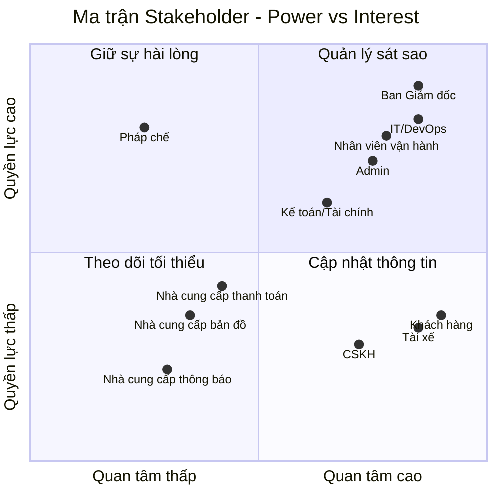
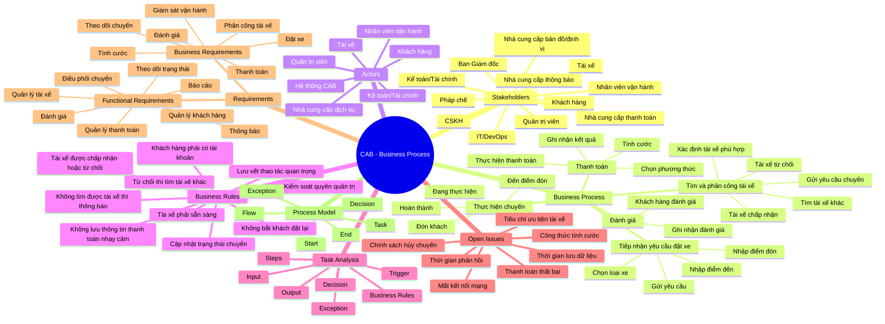

# 23651511_NguyenPhamMaiTrinh_cabsystem
# 1. Hạn chế của hệ thống hiện tại
## a. Các yêu điểm của hệ thống
* Thực hiện thủ công, khách hàng khó theo dõi trạng thái chuyến đi, thông tin thanh toán chưa được quản lý tập trung và bộ phận vận hành gặp khó khăn khi muốn mở rộng hệ thống
## b. Tại sao cần hệ thống mới?
* Đáp ứng quy mô lớn: Phục vụ số lượng lớn khách hàng và tài xế, đồng thời dễ dàng phát triển thêm tính năng trong tương lai.
* Tự động hóa vận hành:Thay thế việc phân công tài xế thủ công bằng cơ chế tự động tìm kiếm, phân phối và xử lý ngoại lệ thông minh.
* Nâng cao trải nghiệm người dùng: Giúp khách hàng theo dõi trực quan trạng thái chuyến đi, còn tài xế dễ dàng nhận/từ chối chuyến xe.
* Quản lý thanh toán tập trung: Tích hợp thanh toán linh hoạt (tiền mặt/điện tử) và bảo mật thông tin nhạy cảm.
* Cải thiện giám sát & báo cáo: Cung cấp giao diện quản trị, thông báo đa kênh và báo cáo hiệu quả hoạt động cho ban lãnh đạo.
* Đảm bảo ổn định & bảo mật: Tăng khả năng mở rộng độc lập từng phần, chống quá tải và bảo mật dữ liệu, phân quyền chặt chẽ.

## 2. Bảng Stakeholder và Vai trò
| STT | Stakeholder | Vai trò |
| :---: | :--- | :--- |
| **1** | Ban Giám đốc | Nhà tài trợ, người ra quyết định|
| **2** | Khách hàng | Người tiêu dùng, người sử dụng cuối|
| **3** | Tài xế | Nhà cung cấp dịch vụ, người thực thi quy trình|
| **4** | Nhân viên vận hành | Người vận hành quy trình|
| **5** | Quản trị viên  | Người kiểm soát quy trình|
| **6** | Bộ phận Kế toán / Tài chính | Người kiểm soát tài chính|
| **7** | Bộ phận CSKH | Chủ sở hữu dịch vụ hỗ trợ|
| **8** | Đội ngũ IT / DevOps | Kiến trúc sư hệ thống & Người bảo trì|
| **9** | Nhà cung cấp thanh toán | Nhà cung cấp tích hợp bên ngoài|
| **10** | Nhà cung cấp bản đồ / định vị | Nhà cung cấp dữ liệu bên ngoài|
| **11** | Nhà cung cấp dịch vụ thông báo | Nhà cung cấp dịch vụ truyền thông bên ngoài|
| **12** | Bộ phận Pháp chế / Cơ quan quản lý | Người đánh giá sự tuân thủ|

### Ma trận Matrix

## Giải thích Ma trận:
* Quản lý sát sao: Ban Giám đốc, IT/DevOps, Nhân viên vận hành, Admin. Đây là nhóm có quyền lực và mức độ quan tâm cao, cần được trao đổi và phối hợp thường xuyên.
* Giữ sự hài lòng: Pháp chế, Kế toán/Tài chính. Nhóm có quyền lực tương đối cao nhưng không trực tiếp tham gia toàn bộ quy trình, cần đảm bảo yêu cầu được đáp ứng.
* Cập nhật thông tin: Khách hàng, Tài xế, CSKH. Nhóm có mức độ quan tâm cao nhưng quyền quyết định thấp, cần được cung cấp thông tin và hỗ trợ thường xuyên.
* Theo dõi tối thiểu: Nhà cung cấp thanh toán, Bản đồ/định vị, Dịch vụ thông báo. Chủ yếu cung cấp dịch vụ hỗ trợ bên ngoài, cần theo dõi tình trạng dịch vụ và xử lý khi có sự cố.
## Minmap

## 3. Business Purpose
* **Tối ưu hóa hiệu suất vận hành:** Tự động hóa hoàn toàn quy trình ghép nối giữa khách hàng và tài xế dựa trên thuật toán định vị thông minh, giúp giảm thiểu thời gian chờ đợi (ETA) và nâng cao tỷ lệ hoàn thành chuyến đi.
* **Minh bạch hóa dòng tiền & Giao dịch tài chính:** Cung cấp hệ thống thanh toán đa dạng (tiền mặt, ví điện tử, thẻ) kết hợp cơ chế đối soát tự động, giúp quản lý doanh thu, chiết khấu và dòng tiền của tài xế một cách chính xác, rõ ràng.
* **Nâng cao trải nghiệm người dùng:** Cung cấp giao diện trực quan, tính năng theo dõi hành trình thời gian thực, hệ thống đánh giá hai chiều và dịch vụ hỗ trợ (CSKH) nhanh chóng nhằm tối ưu hóa sự hài lòng cho cả khách hàng lẫn tài xế.
* **Đảm bảo tuân thủ & Quản trị rủi ro:** Xây dựng hệ thống phân quyền chặt chẽ, kiểm soát dữ liệu người dùng và đảm bảo toàn bộ hoạt động vận hành tuân thủ nghiêm ngặt các quy định pháp lý của cơ quan quản lý nhà nước về lĩnh vực vận tải công nghệ.

## 4. Xác định phạm vi 7 tuần
### a. Module Quản lý Khách hàng
- **Quy trình Xác thực & Hồ sơ:** Hỗ trợ đăng ký, đăng nhập và quản lý thông tin cá nhân.
- **Quy trình Khởi tạo yêu cầu:** Cho phép khách hàng nhập điểm đón, điểm đến, chọn loại dịch vụ và gửi yêu cầu đặt xe.
- **Quy trình Theo dõi chuyến:** Cho phép khách hàng theo dõi trạng thái và thông tin chuyến đi.
- **Quy trình Đánh giá dịch vụ:** Cho phép khách hàng đánh giá tài xế sau khi chuyến hoàn thành.
### b. Module Quản lý Tài xế và Phương tiện
- **Quy trình Quản lý Hồ sơ:** Tiếp nhận và cập nhật thông tin tài xế, phương tiện.
- **Quy trình Quản lý Trạng thái & Vị trí:** Cập nhật trạng thái sẵn sàng của tài xế và thông tin vị trí phục vụ điều phối.
- **Quy trình Thực hiện chuyến:** Tài xế nhận hoặc từ chối chuyến và cập nhật trạng thái trong quá trình thực hiện.
### c. Module Tính cước và Thanh toán
- **Quy trình Tính cước:** Xác định số tiền khách hàng phải thanh toán dựa trên thông tin chuyến và loại dịch vụ.
- **Quy trình Thanh toán:** Hỗ trợ thanh toán bằng tiền mặt hoặc phương thức điện tử.
- **Quy trình Ghi nhận & Xử lý thanh toán:** Ghi nhận kết quả giao dịch, thông báo khi thanh toán thất bại và hỗ trợ xử lý lại theo chính sách.
### d. Module Thông báo
- **Quy trình Thông báo Khách hàng:** Gửi thông tin về yêu cầu đặt xe, trạng thái tài xế, chuyến đi và thanh toán.
- **Quy trình Thông báo Tài xế:** Gửi thông tin chuyến xe và các thay đổi liên quan đến chuyến.
### e. Module Vận hành, Quản trị & Báo cáo
- **Quy trình Giám sát vận hành:** Theo dõi chuyến đi, trạng thái tài xế và xử lý các trường hợp bất thường.
- **Quy trình Quản trị hệ thống:** Quản lý tài khoản, phân quyền và kiểm soát quyền truy cập.
- **Quy trình Quản lý giao dịch:** Tra cứu và theo dõi thông tin giao dịch.
- **Quy trình Báo cáo:** Tổng hợp dữ liệu về chuyến đi, giao dịch và doanh thu phục vụ quản lý.
## 5. Chuyển các yêu cầu thành yêu cầu nghiệp vụ
### a. Yêu cầu Quản lý Khách hàng
- **BRa01:** Cho phép khách hàng đăng ký, đăng nhập và quản lý thông tin cá nhân để sử dụng dịch vụ.
- **BRa02:** Cho phép khách hàng nhập điểm đón, điểm đến, chọn loại dịch vụ và gửi yêu cầu đặt xe.
- **BRa03:** Cung cấp khả năng theo dõi trạng thái và thông tin chuyến đi trong quá trình sử dụng dịch vụ.
- **BRa04:** Thu thập đánh giá của khách hàng về tài xế sau khi chuyến đi hoàn thành.
### b. Yêu cầu Quản lý Tài xế và Phương tiện
- **BRb01:** Quản lý thông tin tài xế và phương tiện phục vụ hoạt động cung cấp dịch vụ.
- **BRb02:** Quản lý trạng thái và vị trí của tài xế để phục vụ việc tìm kiếm và phân công chuyến.
- **BRb03:** Cho phép tài xế tiếp nhận hoặc từ chối chuyến và cập nhật trạng thái trong quá trình thực hiện chuyến.
### c. Yêu cầu Tính cước và Thanh toán
- **BRc01:** Xác định số tiền khách hàng phải thanh toán dựa trên loại dịch vụ và thông tin chuyến đi.
- **BRc02:** Cần hỗ trợ thanh toán bằng tiền mặt và phương thức thanh toán điện tử thông qua nhà cung cấp dịch vụ thanh toán.
- **BRc03:** Cần ghi nhận kết quả thanh toán, thông báo khi giao dịch thất bại và hỗ trợ xử lý lại theo chính sách của doanh nghiệp.
### d. Yêu cầu Thông báo
- **BRd01:** Cung cấp thông tin cập nhật cho khách hàng trong các giai đoạn chính của quá trình đặt và thực hiện chuyến.
- **BRd02:** Cung cấp thông tin chuyến xe và các thay đổi liên quan cho tài xế để hỗ trợ quá trình điều phối và thực hiện chuyến.
### e. Yêu cầu Vận hành, Quản trị & Báo cáo
- **BRe01:** Giám sát các chuyến đi, trạng thái tài xế và xử lý các trường hợp bất thường trong quá trình vận hành.
- **BRe02:** Quản lý tài khoản và phân quyền truy cập theo vai trò để bảo vệ dữ liệu và chức năng của hệ thống.
- **BRe03:** Tổng hợp và cung cấp báo cáo về hoạt động chuyến đi, giao dịch và doanh thu để phục vụ công tác quản lý.
## 6. Phân rã yêu cầu chức năng
### a. Quản lý Tài khoản
- **FRa01:** Người dùng đăng ký tài khoản theo từng loại người dùng được hỗ trợ.
- **FRa02:** Người dùng đăng nhập và khôi phục quyền truy cập tài khoản khi cần.
- **FRa03:** Người dùng xem và cập nhật thông tin hồ sơ cá nhân.
- **FRa04:** Quản trị viên quản lý tài khoản và quyền truy cập của người dùng theo vai trò.
### b. Đặt xe
- **FRb01:** Khách hàng nhập điểm đón, điểm đến và lựa chọn loại dịch vụ khi tạo yêu cầu đặt xe.
- **FRb02:** Hệ thống tiếp nhận và ghi nhận yêu cầu đặt xe của khách hàng.
- **FRb03:** Hệ thống tìm kiếm và đề xuất tài xế phù hợp đang sẵn sàng để thực hiện chuyến.
- **FRb04:** Hệ thống gửi yêu cầu chuyến đến tài xế và cho phép tài xế thực hiện hành động Nhận chuyến hoặc Từ chối chuyến.
- **FRb05:** Khi tài xế từ chối hoặc không nhận chuyến, hệ thống tiếp tục tìm tài xế phù hợp khác.
- **FRb06:** Khi không tìm được tài xế phù hợp, hệ thống thông báo kết quả cho khách hàng.
### c. Chuyến đi & Định vị
- **FRc01:** Hệ thống tiếp nhận và cập nhật thông tin vị trí của tài xế phục vụ việc theo dõi và điều phối chuyến.
- **FRc02:** Hệ thống hiển thị thông tin và trạng thái chuyến đi cho khách hàng và bộ phận vận hành.
- **FRc03:** Hệ thống cho phép tài xế cập nhật trạng thái chuyến theo từng giai đoạn thực hiện.
- **FRc04:** Hệ thống hỗ trợ hủy chuyến theo các điều kiện và chính sách được doanh nghiệp quy định.
- **FRc05:** Hệ thống lưu lại lịch sử và trạng thái của chuyến đi.
### d. Tính cước & Thanh toán
- **FRd01:** Hệ thống xác định số tiền khách hàng phải thanh toán dựa trên loại dịch vụ và thông tin chuyến đi.
- **FRd02:** Hệ thống hỗ trợ thanh toán bằng tiền mặt và phương thức thanh toán điện tử thông qua nhà cung cấp dịch vụ thanh toán.
- **FRd03:** Hệ thống ghi nhận trạng thái thanh toán của từng chuyến đi.
- **FRd04:** Hệ thống thông báo kết quả thanh toán cho khách hàng.
- **FRd05:** Khi giao dịch thanh toán điện tử thất bại, hệ thống thông báo lỗi và hỗ trợ thực hiện lại giao dịch theo chính sách của doanh nghiệp.
### e. Thông báo & Phản hồi
- **FRe01:** Hệ thống gửi thông báo cho khách hàng về các trạng thái chính của yêu cầu và chuyến đi.
- **FRe02:** Hệ thống gửi thông báo cho tài xế về yêu cầu chuyến và các thay đổi liên quan đến chuyến.
- **FRe03:** Khách hàng đánh giá tài xế sau khi chuyến đi hoàn thành.
- **FRe04:** Hệ thống ghi nhận và lưu trữ kết quả đánh giá của khách hàng.
### f. Vận hành, Quản trị & Báo cáo
- **FRf01:** Hệ thống cung cấp giao diện để Nhân viên vận hành theo dõi các chuyến đi và trạng thái tài xế.
- **FRf02:** Nhân viên vận hành xử lý các trường hợp bất thường trong quá trình thực hiện chuyến.
- **FRf03:** Nhân viên vận hành tra cứu thông tin chuyến đi và giao dịch.
- **FRf04:** Quản trị viên quản lý tài khoản, quyền truy cập.
- **FRf05:** Hệ thống tổng hợp dữ liệu chuyến đi, giao dịch và doanh thu để phục vụ công tác báo cáo.
  ## 7. Vẽ usecase
  
  ## 8. Đặc tả usecase
  ## 9. Phân tích quy trình nghiệp vụ
1. **Giai đoạn Khởi tạo & Tiếp nhận:** 
   - Khách hàng thực hiện định danh tài khoản, nhập lộ trình điểm đón và điểm đến. 
   - Hệ thống tự động tính cước dựa trên loại hình dịch vụ và tiếp nhận yêu cầu đặt xe.
2. **Giai đoạn Điều phối & Ghép nối:** 
   - Thuật toán quét và lọc tài xế đang ở trạng thái trực tuyến (Online) dựa trên tọa độ GPS. 
   - Hệ thống tự động gửi tín hiệu điều phối đến tài xế ưu tiên ở vị trí gần nhất.
3. **Giai đoạn Thực thi Dịch vụ:** 
   - Tài xế di chuyển thực hiện cuốc xe và liên tục cập nhật tuần tự các mốc trạng thái nghiệp vụ về trung tâm
4. **Giai đoạn Thanh toán & Đánh giá:** 
   - Hệ thống chốt cước phí dựa trên lộ trình thực tế, xử lý thanh toán linh hoạt (tiền mặt hoặc cổng điện tử bên ngoài). 
   - Sau khi hoàn tất thanh toán, hệ thống kích hoạt vòng lặp phản hồi để khách hàng đánh giá sao cho tài xế.
5. **Giai đoạn Giám sát Vận hành:** 
   - Nhân viên vận hành theo dõi trực tuyến qua Dashboard để can thiệp xử lý ngoại lệ (hủy chuyến, đổi tài xế, khiếu nại). 
   - Hệ thống tự động tổng hợp báo cáo hiệu suất để phục vụ công tác quản trị và ra quyết định của ban lãnh đạo.
  ## 10. Phân tích nguyên tắc nghiệp vụ
* **Quy tắc Phân công và Xử lý từ chối:** Hệ thống bắt buộc phải ưu tiên phân phối cuốc xe cho tài xế ở trạng thái sẵn sàng và ở khoảng cách gần khách hàng nhất. Nếu tài xế được đề xuất từ chối hoặc không phản hồi trong thời gian giới hạn, hệ thống phải tự động chuyển tiếp sang tài xế tiếp theo mà không làm gián đoạn hoặc yêu cầu khách hàng phải tạo lại yêu cầu.
* **Quy tắc Tách biệt Dữ liệu Thanh toán & Bảo mật:** Tuyệt đối không lưu trữ trực tiếp thông tin nhạy cảm của thẻ hoặc tài khoản thanh toán nội bộ bên trong hệ thống CAB System. Mọi giao dịch điện tử phải được thực hiện thông qua liên kết bảo mật với nhà cung cấp cổng thanh toán độc lập bên ngoài.
* **Quy tắc Phân quyền và Kiểm soát Truy cập RBAC:** Mọi tác nhân (Khách hàng, Tài xế, Nhân viên vận hành) phải đi qua cổng định danh và xác thực an toàn. Các thao tác quản trị hệ thống nhạy cảm phải được phân quyền chặt chẽ theo vai trò (RBAC) để bảo vệ dữ liệu cá nhân, phương tiện và giao dịch.
* **Quy tắc Kiến trúc Độc lập & Ổn định:** Các thành phần chức năng (như Thanh toán, Thông báo, Đặt xe) phải được thiết kế dạng module mở rộng độc lập. Khi một sự cố xảy ra ở module phụ trợ (ví dụ lỗi cổng thanh toán hoặc lỗi gửi thông báo), hệ thống không được làm ngưng trệ toàn bộ nền tảng đặt xe và cho phép triển khai nâng cấp từng phần.
  
